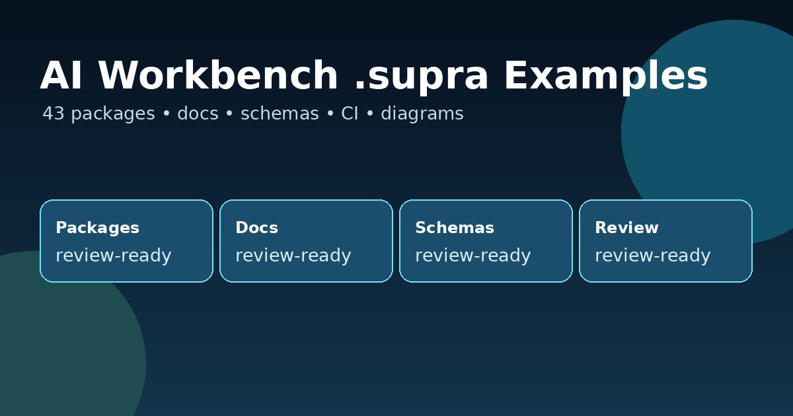

# AI Workbench `.supra` Examples



A portable, ready-to-use `.supra` examples for SupraTix AI Workbench. It can live in any checkout and can be copied into an AI Workbench examples directory when needed.

It contains importable `.supra` packages, generated bilingual package documentation, JSON schemas, validation scripts, governance notes, and reusable image assets for a polished public or private GitHub presentation. Each package is designed to show a concrete business workflow, a reviewable output contract, and starter context that can be adapted safely.

## What is included

- **47 `.supra` packages** at the repository root.
- **English and German generated documentation** under [`docs/`](docs/README.md).
- **Schema contracts** under [`schemas/`](schemas/) for package-level validation and output-contract checks.
- **Local validation scripts** under [`scripts/`](scripts/).
- **GitHub Actions workflow** to validate examples on every pull request.
- **Image assets** for the README, docs, social preview, architecture, workflow, package anatomy, import/export, and governance diagrams.

## Fast start

```bash
# 1) Open this repository checkout
cd AI-Workbench-.supra-Examples

# 2) Validate every .supra package
python3 scripts/validate_supra.py .

# 3) Regenerate docs after edits
python3 scripts/generate_docs.py .

# 4) Optional: regenerate image assets
python3 scripts/render_assets.py .
```

## Repository layout

```text
.
├── *.supra                         # AI Workbench example packages
├── README.md                       # GitHub landing page
├── examples_manifest.json          # Machine-readable package catalog
├── docs/
│   ├── README.md                   # Package index
│   ├── *.en.md / *.de.md           # Generated package docs
│   └── assets/                     # SVG and PNG diagrams
├── schemas/                        # JSON schemas and contract notes
├── scripts/                        # Validation, docs, and asset generators
├── tests/                          # Lightweight pytest compatibility tests
└── .github/                        # CI, issue templates, PR template
```

## Package catalog

| Package                                         | Focus                                                                                                                                                       | Shape                   | Docs                                                                                                                    |
| ----------------------------------------------- | ----------------------------------------------------------------------------------------------------------------------------------------------------------- | ----------------------- | ----------------------------------------------------------------------------------------------------------------------- |
| AE Valley Grant/Tender/Project URL Condenser    | Turn grant, tender, and project URLs into a compact evidence brief that summarizes fit, bid readiness, funding risks, and next validation steps.            | 17 columns / 1 workflow | [EN](docs/aevalley_grant_tender_url_condenser.en.md) · [DE](docs/aevalley_grant_tender_url_condenser.de.md)             |
| Data Analytics Experiment And Launch Analyzer   | Turn experiment or launch notes into a decision-ready analytics review with hypothesis checks, outcome signals, risks, and follow-up instrumentation needs. | 4 columns / 1 workflow  | [EN](docs/data_analytics_experiment_launch_analyzer.en.md) · [DE](docs/data_analytics_experiment_launch_analyzer.de.md) |
| Data Analytics KPI Framework Designer           | Design a practical KPI framework that connects goals to metric definitions, owners, guardrails, review cadence, and adoption-ready reporting notes.         | 4 columns / 1 workflow  | [EN](docs/data_analytics_kpi_framework_designer.en.md) · [DE](docs/data_analytics_kpi_framework_designer.de.md)         |
| Data Analytics KPI Operating Review             | Create a structured KPI operating review that summarizes status, risks, corrective actions, owners, and follow-up triggers for recurring business reviews.  | 4 columns / 1 workflow  | [EN](docs/data_analytics_kpi_operating_review.en.md) · [DE](docs/data_analytics_kpi_operating_review.de.md)             |
| Data Analytics Market And Opportunity Sizer     | Estimate market or opportunity size with transparent assumptions, sizing scenarios, sensitivity checks, evidence gaps, and validation priorities.           | 4 columns / 1 workflow  | [EN](docs/data_analytics_market_opportunity_sizer.en.md) · [DE](docs/data_analytics_market_opportunity_sizer.de.md)     |
| Field Service Maintenance Report                | Turn technician voice notes or transcripts into a traceable maintenance report and customer summary.                                                        | 4 columns / 1 workflow  | [EN](docs/field_service_maintenance_report.en.md) · [DE](docs/field_service_maintenance_report.de.md)                   |
| KMU Tender Factory                              | Parse tender PDFs into a criteria-mapped proposal draft, scoring matrix, compliance checklist, and evidence bundle for SME submissions.                     | 5 columns / 1 workflow  | [EN](docs/kmu_tender_factory.en.md) · [DE](docs/kmu_tender_factory.de.md)                                               |
| Lieferschein → Lagerbestand (Internal Products) | Map delivery-note lines to internal products, flag ambiguous matches, and produce a reviewable stock update proposal for inventory teams.                   | 3 columns / 0 workflows | [EN](docs/lieferschein_inventory.en.md) · [DE](docs/lieferschein_inventory.de.md)                                       |
| LinkedIn Extreme Engagement Posting             | Create a high-engagement LinkedIn publishing package with hooks, post variants, positioning notes, risk checks, and engagement follow-up prompts.           | 9 columns / 1 workflow  | [EN](docs/linkedin_extreme_engagement_posting.en.md) · [DE](docs/linkedin_extreme_engagement_posting.de.md)             |
| MINT Study Planning                             | Generate structured MINT/STEM study plans from learner goals, baseline skills, schedule, constraints, milestones, resources, and assessments.               | 4 columns / 1 workflow  | [EN](docs/mint_study_planning.en.md) · [DE](docs/mint_study_planning.de.md)                                             |
| SME AI Adoption Readiness Sprint                | Assess SME AI adoption readiness and turn constraints, data quality, risks, and team capacity into a concrete first-sprint action plan.                     | 4 columns / 1 workflow  | [EN](docs/sme_ai_adoption_readiness_sprint.en.md) · [DE](docs/sme_ai_adoption_readiness_sprint.de.md)                   |
| SME Cashflow War Room                           | Prioritize cashflow risks from receivables, payables, and commitments, then convert them into an owner-ready recovery board with escalation triggers.       | 4 columns / 1 workflow  | [EN](docs/sme_cashflow_war_room.en.md) · [DE](docs/sme_cashflow_war_room.de.md)                                         |
| SME Churn Rescue Desk                           | Identify churn signals from customer context and produce a practical rescue plan with root causes, owner actions, and review triggers.                      | 4 columns / 1 workflow  | [EN](docs/sme_churn_rescue_desk.en.md) · [DE](docs/sme_churn_rescue_desk.de.md)                                         |
| SME Compliance Evidence Pack                    | Organize compliance facts into an evidence pack that highlights obligations, proof gaps, owners, deadlines, and reviewer-ready notes.                       | 4 columns / 1 workflow  | [EN](docs/sme_compliance_evidence_pack.en.md) · [DE](docs/sme_compliance_evidence_pack.de.md)                           |
| SME Customer Reply                              | Draft a professional customer response that balances tone, facts, evidence gaps, commitments, and follow-up checks for sensitive service situations.        | 4 columns / 1 workflow  | [EN](docs/sme_customer_reply.en.md) · [DE](docs/sme_customer_reply.de.md)                                               |
| SME Cyber Hygiene Action Board                  | Convert cyber hygiene observations into a prioritized remediation board with risk level, responsible owners, due dates, and verification checks.            | 4 columns / 1 workflow  | [EN](docs/sme_cyber_hygiene_action_board.en.md) · [DE](docs/sme_cyber_hygiene_action_board.de.md)                       |
| SME Data Cleanup Command Center                 | Create a practical data cleanup plan with issue categories, quality rules, owners, validation checks, and a sequence for remediation.                       | 4 columns / 1 workflow  | [EN](docs/sme_data_cleanup_command_center.en.md) · [DE](docs/sme_data_cleanup_command_center.de.md)                     |
| SME Deadstock Liquidator                        | Identify deadstock risks from inventory signals and turn them into a liquidation plan with pricing options, channels, owners, and review metrics.           | 4 columns / 1 workflow  | [EN](docs/sme_deadstock_liquidator.en.md) · [DE](docs/sme_deadstock_liquidator.de.md)                                   |
| SME Downtime Triage                             | Diagnose downtime context and create a focused triage plan that separates immediate fixes, root-cause hypotheses, prevention actions, and owners.           | 4 columns / 1 workflow  | [EN](docs/sme_downtime_triage.en.md) · [DE](docs/sme_downtime_triage.de.md)                                             |
| SME Energy Cost Anomaly Finder                  | Spot energy-cost anomalies, separate likely drivers from assumptions, and propose reviewable savings or investigation actions with ownership.               | 4 columns / 1 workflow  | [EN](docs/sme_energy_cost_anomaly_finder.en.md) · [DE](docs/sme_energy_cost_anomaly_finder.de.md)                       |
| SME ESG Sustainability Copilot                  | Consolidate sustainability evidence into an ESG readiness scorecard, gap analysis and action plan.                                                          | 3 columns / 1 workflow  | [EN](docs/sme_esg_sustainability_copilot.en.md) · [DE](docs/sme_esg_sustainability_copilot.de.md)                       |
| SME Field Service Route Optimizer               | Turn service jobs, technician capacity, travel constraints, and priority rules into a route-optimization action brief for field teams.                      | 4 columns / 1 workflow  | [EN](docs/sme_field_service_route_optimizer.en.md) · [DE](docs/sme_field_service_route_optimizer.de.md)                 |
| SME Grant Funding Fit Radar                     | Assess grant-fit signals and produce a shortlist with eligibility notes, evidence gaps, deadlines, effort estimates, and application next steps.            | 4 columns / 1 workflow  | [EN](docs/sme_grant_funding_fit_radar.en.md) · [DE](docs/sme_grant_funding_fit_radar.de.md)                             |
| SME Hiring Scorecard Kit                        | Create a role scorecard with success outcomes, interview signals, decision rubric, evidence prompts, and hiring risk notes for SME teams.                   | 4 columns / 1 workflow  | [EN](docs/sme_hiring_scorecard_kit.en.md) · [DE](docs/sme_hiring_scorecard_kit.de.md)                                   |
| SME Invoice Dispute Resolver                    | Structure invoice-dispute facts into a resolution plan with claim summary, evidence gaps, negotiation options, owners, and escalation triggers.             | 4 columns / 1 workflow  | [EN](docs/sme_invoice_dispute_resolver.en.md) · [DE](docs/sme_invoice_dispute_resolver.de.md)                           |
| SME Late Payment Collector                      | Prepare a humane but firm late-payment collection plan with customer context, message drafts, escalation path, and payment-risk signals.                    | 4 columns / 1 workflow  | [EN](docs/sme_late_payment_collector.en.md) · [DE](docs/sme_late_payment_collector.de.md)                               |
| SME Lead Qualifier                              | Qualify leads using fit, urgency, budget signals, risk flags, and next-best-action recommendations for practical sales follow-up.                           | 4 columns / 1 workflow  | [EN](docs/sme_lead_qualifier.en.md) · [DE](docs/sme_lead_qualifier.de.md)                                               |
| SME Local SEO Content Engine                    | Generate local SEO content briefs from business context, service areas, customer proof points, search intent, and page-level action notes.                  | 4 columns / 1 workflow  | [EN](docs/sme_local_seo_content_engine.en.md) · [DE](docs/sme_local_seo_content_engine.de.md)                           |
| SME Margin Leak Detector                        | Identify margin leakage from pricing, discounting, cost, and delivery signals, then create a practical profit-protection action plan.                       | 4 columns / 1 workflow  | [EN](docs/sme_margin_leak_detector.en.md) · [DE](docs/sme_margin_leak_detector.de.md)                                   |
| SME Meeting Summarizer                          | Summarize meeting notes into decisions, actions, risks, owners, due dates, evidence gaps, and follow-up prompts.                                            | 4 columns / 1 workflow  | [EN](docs/sme_meeting_summarizer.en.md) · [DE](docs/sme_meeting_summarizer.de.md)                                       |
| SME Onboarding Micro-SOP Factory                | Turn onboarding context into short SOPs, role-ready checklists, common mistake warnings, and review prompts for new team members.                           | 4 columns / 1 workflow  | [EN](docs/sme_onboarding_micro_sop_factory.en.md) · [DE](docs/sme_onboarding_micro_sop_factory.de.md)                   |
| SME Pricing Power Simulator                     | Assess pricing power using demand, competition, cost, and customer signals, then propose scenarios, guardrails, and review triggers.                        | 4 columns / 1 workflow  | [EN](docs/sme_pricing_power_simulator.en.md) · [DE](docs/sme_pricing_power_simulator.de.md)                             |
| SME Product Launch Kill/Scale Gate              | Create a kill/scale gate for product launch decisions with evidence summary, confidence level, risks, and next actions.                                     | 4 columns / 1 workflow  | [EN](docs/sme_product_launch_kill_scale_gate.en.md) · [DE](docs/sme_product_launch_kill_scale_gate.de.md)               |
| SME Proposal Drafter                            | Draft a proposal brief with client goals, scope, assumptions, deliverables, exclusions, risks, and next-step language.                                      | 4 columns / 1 workflow  | [EN](docs/sme_proposal_drafter.en.md) · [DE](docs/sme_proposal_drafter.de.md)                                           |
| SME Quote-to-Cash Bottleneck Scanner            | Scan quote-to-cash flow for handoff bottlenecks, missing data, aging risks, and owner-ready fixes that protect revenue timing.                              | 4 columns / 1 workflow  | [EN](docs/sme_quote_to_cash_bottleneck.en.md) · [DE](docs/sme_quote_to_cash_bottleneck.de.md)                           |
| SME Review Reputation Responder                 | Draft review responses and reputation recovery actions with evidence-aware tone, escalation guidance, service signals, and follow-up checks.                | 4 columns / 1 workflow  | [EN](docs/sme_review_reputation_responder.en.md) · [DE](docs/sme_review_reputation_responder.de.md)                     |
| SME Safety Incident Prevention Loop             | Convert safety incident notes into prevention actions with root-cause hypotheses, responsible owners, verification checks, and review triggers.             | 4 columns / 1 workflow  | [EN](docs/sme_safety_incident_prevention.en.md) · [DE](docs/sme_safety_incident_prevention.de.md)                       |
| SME Shift Handover Risk Radar                   | Identify handover risks and produce a shift-ready mitigation brief with priority issues, owner checks, open questions, and escalation signals.              | 4 columns / 1 workflow  | [EN](docs/sme_shift_handover_risk_radar.en.md) · [DE](docs/sme_shift_handover_risk_radar.de.md)                         |
| SME SOP Builder                                 | Transform process context into a clear SOP with roles, inputs, steps, quality checks, exceptions, and review cadence.                                       | 4 columns / 1 workflow  | [EN](docs/sme_sop_builder.en.md) · [DE](docs/sme_sop_builder.de.md)                                                     |
| SME Subscription Retention Playbook             | Build a subscription retention playbook from customer signals, renewal risks, intervention actions, owners, and review metrics.                             | 4 columns / 1 workflow  | [EN](docs/sme_subscription_retention_playbook.en.md) · [DE](docs/sme_subscription_retention_playbook.de.md)             |
| SME Tender No-Bid Gate                          | Create a tender bid/no-bid recommendation with fit scoring, evidence gaps, delivery risks, governance notes, and next actions.                              | 4 columns / 1 workflow  | [EN](docs/sme_tender_no_bid_gate.en.md) · [DE](docs/sme_tender_no_bid_gate.de.md)                                       |
| SME Training Skill Gap Matrix                   | Map training needs into a skill-gap matrix with role impact, priority learning actions, owners, and progress review prompts.                                | 4 columns / 1 workflow  | [EN](docs/sme_training_skill_gap_matrix.en.md) · [DE](docs/sme_training_skill_gap_matrix.de.md)                         |
| SME Upsell Signal Miner                         | Find upsell signals in account context and convert them into account-specific offers, timing notes, risk flags, and next actions.                           | 4 columns / 1 workflow  | [EN](docs/sme_upsell_signal_miner.en.md) · [DE](docs/sme_upsell_signal_miner.de.md)                                     |
| SME Vendor Negotiation Brief                    | Prepare a vendor negotiation brief with leverage signals, target asks, fallback options, risk notes, and owner-ready talking points.                        | 4 columns / 1 workflow  | [EN](docs/sme_vendor_negotiation_brief.en.md) · [DE](docs/sme_vendor_negotiation_brief.de.md)                           |
| SME Warranty Root Cause Radar                   | Analyze warranty issues to propose root-cause hypotheses, containment actions, evidence gaps, customer impact notes, and prevention checks.                 | 4 columns / 1 workflow  | [EN](docs/sme_warranty_root_cause_radar.en.md) · [DE](docs/sme_warranty_root_cause_radar.de.md)                         |
| SME Webshop Conversion Rescue                   | Diagnose webshop conversion problems and produce a prioritized rescue plan covering funnel signals, friction points, experiments, and owner actions.        | 4 columns / 1 workflow  | [EN](docs/sme_webshop_conversion_rescue.en.md) · [DE](docs/sme_webshop_conversion_rescue.de.md)                         |
| SupraWorx Workforce Intelligence Platform       | Preserve expert knowledge, map competency risk, and orchestrate learning, succession, and recruiting workflows with explainable AI receipts.                | 9 columns / 1 workflow  | [EN](docs/workforce_intelligence_platform.en.md) · [DE](docs/workforce_intelligence_platform.de.md)                     |

## `.supra` package conventions

Each package is JSON with a `.supra` extension. The key sections are:

1. `metadata` — vendor, version, starter rows, commerce metadata, and GitHub-example notes.
2. `columns` — manual, AI-tool, and shortcut columns with prompt execution settings.
3. `workflows` — ordered workbench steps when the package is workflow-enabled.
4. `main_workbench` — a portable workbench definition that mirrors the package columns and workflows.
5. `tooling.output_contract` — expected JSON shape, required fields, quality gate, and evidence policy.

For the full normative description, see [The `.supra` v1 Standard](docs/supra-v1-standard.md). For repair work, use the [standard fix playbook](docs/supra-v1-standard-fix.md).

## Import flow


1. Validate package JSON locally.
2. Review generated docs and output contracts.
3. Import the `.supra` file into AI Workbench.
4. Run starter rows in manual-review mode.
5. Capture improvements as a pull request.

## Governance baseline

The examples intentionally default to human-reviewable execution. Prompts ask the model to separate facts from assumptions, mark evidence gaps, and avoid invented facts. Finance, legal, safety, and compliance-sensitive recommendations are marked for responsible human review.

## Publishing checklist

- [ ] Confirm package titles and descriptions.
- [ ] Run `python3 scripts/validate_supra.py .`.
- [ ] Run `python3 scripts/generate_docs.py .` and commit changed docs.
- [ ] Review diagrams in `docs/assets/`.
- [ ] Decide whether this repository should use `LICENSE.template` or a project-specific license.
- [ ] Create the GitHub repository and push.

## Copy into an AI Workbench examples directory

```bash
./scripts/install_to_supraworx_examples.sh path/to/ai-workbench/examples

# Or use an environment variable for repeated installs
export SUPRAWORX_EXAMPLES_DIR="path/to/ai-workbench/examples"
./scripts/install_to_supraworx_examples.sh

cd path/to/ai-workbench/examples
python3 scripts/validate_supra.py .
```

## Maintainer notes

This repository is intentionally dependency-light. The validation script uses the Python standard library only. PNG asset regeneration uses Pillow when available and falls back to SVG-only output if Pillow is not installed.
