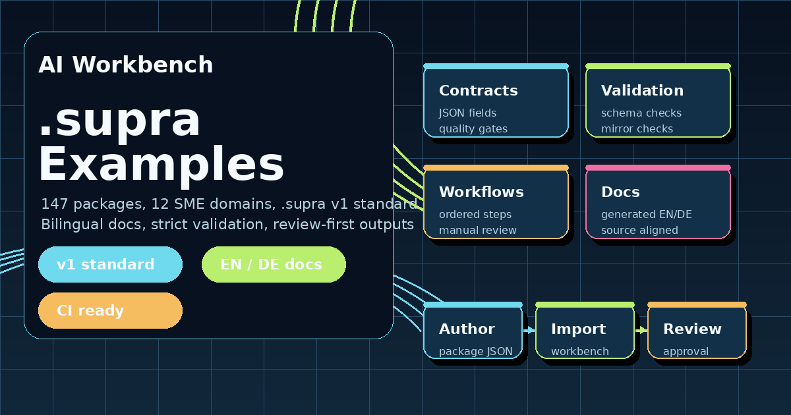
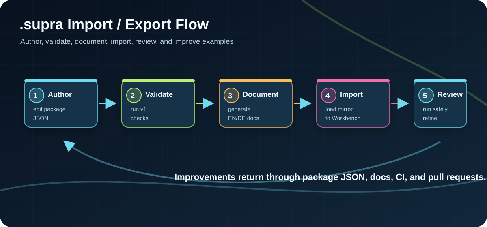

# AI Workbench `.supra` Examples



🇩🇪 [Deutsche Version](README.de.md)

A portable, ready-to-use collection of **147 `.supra` packages** for SupraTix AI Workbench (SupraWorx v3.0), organised into **12 SME domains**. Every package is a complete, reviewable workbench: intake, evidence extraction, decision plan, and a managed execution brief — with output contracts, starter data, and bilingual documentation.

Every package is validated against the [`.supra` v1 standard](docs/supra-v1-standard.md) **and** against the strict SupraWorx importer (allow-lists, size limits, and the managed-shortcut gate). See the [import evaluation](docs/import-evaluation.en.md) for what was tested and what was fixed.

## What is included

- **147 `.supra` packages** under [`packages/<domain>/`](packages/) — 47 hand-written packages plus 100 generated SME packages.
- **English and German documentation** for every package under [`docs/packages/`](docs/README.md), plus bilingual guides.
- **Generators**: 100 SME packages are produced from a compact spec (`scripts/data/sme_use_cases.json`), and the matching SupraWorx shortcut registry entries are rendered from the same spec.
- **Validation** that mirrors the SupraWorx importer, a GitHub Actions workflow, pytest checks, JSON schemas, and diagram assets.

## Domains

| Folder | English | Deutsch | Packages | Examples |
| --- | --- | --- | ---: | --- |
| [`finance_cash`](packages/finance_cash/README.md) | Finance & Cash | Finanzen & Liquidität | 16 | `sme_cashflow_war_room`, `sme_thirteen_week_cash_forecast`, `sme_credit_risk_screener`, … |
| [`sales_growth`](packages/sales_growth/README.md) | Sales & Growth | Vertrieb & Wachstum | 15 | `sme_lead_qualifier`, `sme_cold_outreach_sequencer`, `sme_discount_approval_gate`, … |
| [`marketing_content`](packages/marketing_content/README.md) | Marketing & Content | Marketing & Content | 12 | `sme_brand_messaging_kit`, `sme_ad_campaign_brief_builder`, `linkedin_extreme_engagement_posting`, … |
| [`customer_service`](packages/customer_service/README.md) | Customer Service | Kundenservice | 10 | `sme_customer_reply`, `sme_complaint_root_cause_clusterer`, `sme_service_recovery_playbook`, … |
| [`operations_production`](packages/operations_production/README.md) | Operations & Production | Betrieb & Produktion | 15 | `sme_downtime_triage`, `sme_production_bottleneck_finder`, `sme_work_instruction_writer`, … |
| [`supply_chain_procurement`](packages/supply_chain_procurement/README.md) | Supply Chain & Procurement | Lieferkette & Einkauf | 12 | `sme_vendor_negotiation_brief`, `sme_supplier_risk_scorecard`, `sme_make_or_buy_decider`, … |
| [`people_hr`](packages/people_hr/README.md) | People & HR | Personal & HR | 13 | `sme_hiring_scorecard_kit`, `sme_shift_roster_builder`, `sme_employee_retention_risk_radar`, … |
| [`compliance_risk_esg`](packages/compliance_risk_esg/README.md) | Compliance, Risk & ESG | Compliance, Risiko & ESG | 12 | `sme_compliance_evidence_pack`, `sme_gdpr_processing_register`, `sme_carbon_footprint_estimator`, … |
| [`it_digital_data`](packages/it_digital_data/README.md) | IT, Digital & Data | IT, Digitalisierung & Daten | 11 | `sme_ai_adoption_readiness_sprint`, `sme_ai_use_policy_drafter`, `sme_data_backup_recovery_check`, … |
| [`strategy_analytics`](packages/strategy_analytics/README.md) | Strategy & Analytics | Strategie & Analytik | 14 | `data_analytics_kpi_framework_designer`, `sme_okr_drafting_assistant`, `sme_scenario_stress_tester`, … |
| [`public_funding_tenders`](packages/public_funding_tenders/README.md) | Public Funding & Tenders | Förderung & Ausschreibungen | 10 | `kmu_tender_factory`, `sme_grant_application_drafter`, `sme_public_tender_compliance_matrix`, … |
| [`education_learning`](packages/education_learning/README.md) | Education & Learning | Bildung & Lernen | 7 | `mint_study_planning`, `sme_expert_knowledge_capture`, `sme_micro_learning_series_planner`, … |

The full catalog with descriptions in both languages is in [`docs/README.md`](docs/README.md); the machine-readable version is [`examples_manifest.json`](examples_manifest.json).

## Fast start

```bash
cd AI-Workbench-.supra-Examples

# Validate every package (.supra v1 standard + SupraWorx importer compatibility)
python3 scripts/validate_supra.py .

# Regenerate the 100 SME packages, docs, catalog, domain indexes and manifest after edits
python3 scripts/new_sme_package.py .
python3 scripts/generate_docs.py .

# Optional: regenerate image assets
python3 scripts/render_assets.py .
```

## Repository layout

```text
.
├── packages/<domain>/*.supra       # 147 AI Workbench packages in 12 domain folders (+ README per domain)
├── docs/
│   ├── README.md                   # Catalog grouped by domain (EN/DE)
│   ├── packages/*.en.md / *.de.md  # Generated package docs
│   ├── import-evaluation.{en,de}.md# SupraWorx v3.0 import evaluation
│   ├── repository-guide.{en,de}.md # Layout, generators, adding packages, install
│   ├── supra-v1-standard*.md       # The standard and its fix playbook
│   └── assets/                     # SVG and PNG diagrams
├── scripts/                        # Validation, generators, docs, assets, install
│   └── data/                       # Use-case specs, translations, domain map, shortcut registry
├── schemas/                        # JSON schemas and contract notes
├── tests/                          # pytest checks (mirrored by CI)
├── examples_manifest.json          # Machine-readable catalog
└── .github/                        # CI, issue templates, PR template
```

## `.supra` package conventions

Each package is JSON with a `.supra` extension. The key sections are:

1. `metadata` — vendor, version, starter rows, commerce metadata, and `source_attribution`. Only fields on the SupraWorx importer allow-list are used.
2. `columns` — manual, AI-tool, and shortcut columns with prompt execution settings.
3. `workflows` — ordered workbench steps.
4. `main_workbench` — a portable workbench definition that mirrors the package columns and workflows.
5. `tooling.output_contract` — expected JSON shape, required fields, quality gate, and evidence policy.

The 100 generated SME packages share one reviewable shape: *Business context → Signal map → Decision plan → Execution brief*. The last step is a managed SME shortcut whose ID equals the package key. For the full normative description see [The `.supra` v1 Standard](docs/supra-v1-standard.md); for repair work use the [standard fix playbook](docs/supra-v1-standard-fix.md).

## Import into SupraWorx AI Workbench



Two paths are supported:

1. **File upload** in AI Workbench — the package must pass the strict validator and reference only registered shortcuts. 145 of 147 packages qualify (two documented exceptions, see the [evaluation](docs/import-evaluation.en.md)).
2. **Template gallery** — copy packages into `mint/workbench/examples/`:

   ```bash
   ./scripts/install_to_supraworx_examples.sh path/to/supraworxv30/mint/workbench/examples          # all domains
   ./scripts/install_to_supraworx_examples.sh path/to/supraworxv30/mint/workbench/examples finance_cash
   ```

Register the shortcut IDs of the new packages in SupraWorx once (no task code changes needed):

```bash
python3 scripts/render_sme_shortcut_specs.py . --apply path/to/supraworxv30/mint/shortcuts/services/sme_shortcuts.py
```

Details, prerequisites and the file-count note for `test_supra_catalog.py` are in the [repository guide](docs/repository-guide.en.md).

## Governance baseline

The examples intentionally default to human-reviewable execution. Prompts ask the model to separate facts from assumptions, mark evidence gaps, and avoid invented facts. Finance, legal, safety, HR, and compliance-sensitive recommendations are marked for responsible human review. Starter data is synthetic.

## Contributing

See [CONTRIBUTING.md](CONTRIBUTING.md) and the [repository guide](docs/repository-guide.en.md) for how to add a generated SME package (edit the spec, regenerate) or a hand-written package.

## Maintainer notes

This repository is intentionally dependency-light. All scripts use the Python standard library only; PNG asset regeneration uses Pillow when available and falls back to SVG-only output otherwise.
