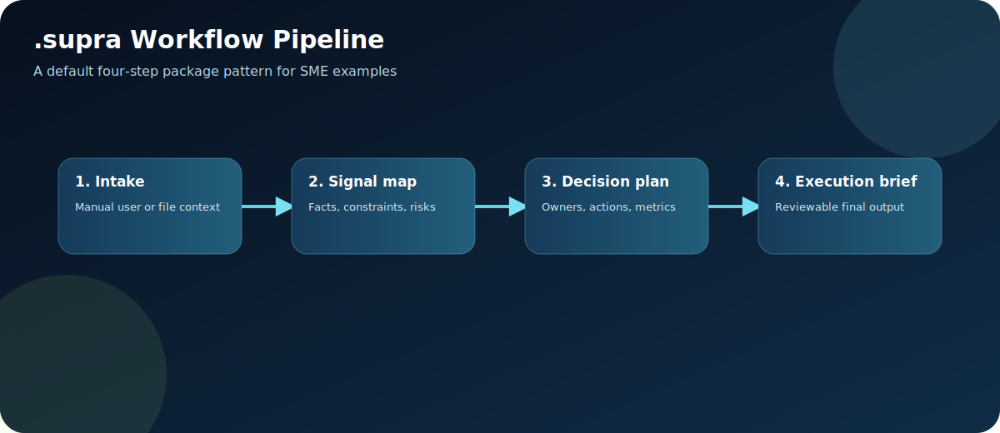

# `.supra` Example Documentation

Generated German and English Markdown documentation for every `.supra` package in this examples repository.



| Package                                         | Columns | Workflows | Deutsch                                                                                              | English                                                                                              |
| ----------------------------------------------- | ------- | --------- | ---------------------------------------------------------------------------------------------------- | ---------------------------------------------------------------------------------------------------- |
| AE Valley Grant/Tender/Project URL Condenser    | 17      | 1         | [`aevalley_grant_tender_url_condenser.de.md`](aevalley_grant_tender_url_condenser.de.md)             | [`aevalley_grant_tender_url_condenser.en.md`](aevalley_grant_tender_url_condenser.en.md)             |
| Data Analytics Experiment And Launch Analyzer   | 4       | 1         | [`data_analytics_experiment_launch_analyzer.de.md`](data_analytics_experiment_launch_analyzer.de.md) | [`data_analytics_experiment_launch_analyzer.en.md`](data_analytics_experiment_launch_analyzer.en.md) |
| Data Analytics KPI Framework Designer           | 4       | 1         | [`data_analytics_kpi_framework_designer.de.md`](data_analytics_kpi_framework_designer.de.md)         | [`data_analytics_kpi_framework_designer.en.md`](data_analytics_kpi_framework_designer.en.md)         |
| Data Analytics KPI Operating Review             | 4       | 1         | [`data_analytics_kpi_operating_review.de.md`](data_analytics_kpi_operating_review.de.md)             | [`data_analytics_kpi_operating_review.en.md`](data_analytics_kpi_operating_review.en.md)             |
| Data Analytics Market And Opportunity Sizer     | 4       | 1         | [`data_analytics_market_opportunity_sizer.de.md`](data_analytics_market_opportunity_sizer.de.md)     | [`data_analytics_market_opportunity_sizer.en.md`](data_analytics_market_opportunity_sizer.en.md)     |
| Lieferschein → Lagerbestand (Internal Products) | 3       | 0         | [`lieferschein_inventory.de.md`](lieferschein_inventory.de.md)                                       | [`lieferschein_inventory.en.md`](lieferschein_inventory.en.md)                                       |
| LinkedIn Extreme Engagement Posting             | 9       | 1         | [`linkedin_extreme_engagement_posting.de.md`](linkedin_extreme_engagement_posting.de.md)             | [`linkedin_extreme_engagement_posting.en.md`](linkedin_extreme_engagement_posting.en.md)             |
| SME AI Adoption Readiness Sprint                | 4       | 1         | [`sme_ai_adoption_readiness_sprint.de.md`](sme_ai_adoption_readiness_sprint.de.md)                   | [`sme_ai_adoption_readiness_sprint.en.md`](sme_ai_adoption_readiness_sprint.en.md)                   |
| SME Cashflow War Room                           | 4       | 1         | [`sme_cashflow_war_room.de.md`](sme_cashflow_war_room.de.md)                                         | [`sme_cashflow_war_room.en.md`](sme_cashflow_war_room.en.md)                                         |
| SME Churn Rescue Desk                           | 4       | 1         | [`sme_churn_rescue_desk.de.md`](sme_churn_rescue_desk.de.md)                                         | [`sme_churn_rescue_desk.en.md`](sme_churn_rescue_desk.en.md)                                         |
| SME Compliance Evidence Pack                    | 4       | 1         | [`sme_compliance_evidence_pack.de.md`](sme_compliance_evidence_pack.de.md)                           | [`sme_compliance_evidence_pack.en.md`](sme_compliance_evidence_pack.en.md)                           |
| SME Customer Reply                              | 4       | 1         | [`sme_customer_reply.de.md`](sme_customer_reply.de.md)                                               | [`sme_customer_reply.en.md`](sme_customer_reply.en.md)                                               |
| SME Cyber Hygiene Action Board                  | 4       | 1         | [`sme_cyber_hygiene_action_board.de.md`](sme_cyber_hygiene_action_board.de.md)                       | [`sme_cyber_hygiene_action_board.en.md`](sme_cyber_hygiene_action_board.en.md)                       |
| SME Data Cleanup Command Center                 | 4       | 1         | [`sme_data_cleanup_command_center.de.md`](sme_data_cleanup_command_center.de.md)                     | [`sme_data_cleanup_command_center.en.md`](sme_data_cleanup_command_center.en.md)                     |
| SME Deadstock Liquidator                        | 4       | 1         | [`sme_deadstock_liquidator.de.md`](sme_deadstock_liquidator.de.md)                                   | [`sme_deadstock_liquidator.en.md`](sme_deadstock_liquidator.en.md)                                   |
| SME Downtime Triage                             | 4       | 1         | [`sme_downtime_triage.de.md`](sme_downtime_triage.de.md)                                             | [`sme_downtime_triage.en.md`](sme_downtime_triage.en.md)                                             |
| SME Energy Cost Anomaly Finder                  | 4       | 1         | [`sme_energy_cost_anomaly_finder.de.md`](sme_energy_cost_anomaly_finder.de.md)                       | [`sme_energy_cost_anomaly_finder.en.md`](sme_energy_cost_anomaly_finder.en.md)                       |
| SME Field Service Route Optimizer               | 4       | 1         | [`sme_field_service_route_optimizer.de.md`](sme_field_service_route_optimizer.de.md)                 | [`sme_field_service_route_optimizer.en.md`](sme_field_service_route_optimizer.en.md)                 |
| SME Grant Funding Fit Radar                     | 4       | 1         | [`sme_grant_funding_fit_radar.de.md`](sme_grant_funding_fit_radar.de.md)                             | [`sme_grant_funding_fit_radar.en.md`](sme_grant_funding_fit_radar.en.md)                             |
| SME Hiring Scorecard Kit                        | 4       | 1         | [`sme_hiring_scorecard_kit.de.md`](sme_hiring_scorecard_kit.de.md)                                   | [`sme_hiring_scorecard_kit.en.md`](sme_hiring_scorecard_kit.en.md)                                   |
| SME Invoice Dispute Resolver                    | 4       | 1         | [`sme_invoice_dispute_resolver.de.md`](sme_invoice_dispute_resolver.de.md)                           | [`sme_invoice_dispute_resolver.en.md`](sme_invoice_dispute_resolver.en.md)                           |
| SME Late Payment Collector                      | 4       | 1         | [`sme_late_payment_collector.de.md`](sme_late_payment_collector.de.md)                               | [`sme_late_payment_collector.en.md`](sme_late_payment_collector.en.md)                               |
| SME Lead Qualifier                              | 4       | 1         | [`sme_lead_qualifier.de.md`](sme_lead_qualifier.de.md)                                               | [`sme_lead_qualifier.en.md`](sme_lead_qualifier.en.md)                                               |
| SME Local SEO Content Engine                    | 4       | 1         | [`sme_local_seo_content_engine.de.md`](sme_local_seo_content_engine.de.md)                           | [`sme_local_seo_content_engine.en.md`](sme_local_seo_content_engine.en.md)                           |
| SME Margin Leak Detector                        | 4       | 1         | [`sme_margin_leak_detector.de.md`](sme_margin_leak_detector.de.md)                                   | [`sme_margin_leak_detector.en.md`](sme_margin_leak_detector.en.md)                                   |
| SME Meeting Summarizer                          | 4       | 1         | [`sme_meeting_summarizer.de.md`](sme_meeting_summarizer.de.md)                                       | [`sme_meeting_summarizer.en.md`](sme_meeting_summarizer.en.md)                                       |
| SME Onboarding Micro-SOP Factory                | 4       | 1         | [`sme_onboarding_micro_sop_factory.de.md`](sme_onboarding_micro_sop_factory.de.md)                   | [`sme_onboarding_micro_sop_factory.en.md`](sme_onboarding_micro_sop_factory.en.md)                   |
| SME Pricing Power Simulator                     | 4       | 1         | [`sme_pricing_power_simulator.de.md`](sme_pricing_power_simulator.de.md)                             | [`sme_pricing_power_simulator.en.md`](sme_pricing_power_simulator.en.md)                             |
| SME Product Launch Kill/Scale Gate              | 4       | 1         | [`sme_product_launch_kill_scale_gate.de.md`](sme_product_launch_kill_scale_gate.de.md)               | [`sme_product_launch_kill_scale_gate.en.md`](sme_product_launch_kill_scale_gate.en.md)               |
| SME Proposal Drafter                            | 4       | 1         | [`sme_proposal_drafter.de.md`](sme_proposal_drafter.de.md)                                           | [`sme_proposal_drafter.en.md`](sme_proposal_drafter.en.md)                                           |
| SME Quote-to-Cash Bottleneck Scanner            | 4       | 1         | [`sme_quote_to_cash_bottleneck.de.md`](sme_quote_to_cash_bottleneck.de.md)                           | [`sme_quote_to_cash_bottleneck.en.md`](sme_quote_to_cash_bottleneck.en.md)                           |
| SME Review Reputation Responder                 | 4       | 1         | [`sme_review_reputation_responder.de.md`](sme_review_reputation_responder.de.md)                     | [`sme_review_reputation_responder.en.md`](sme_review_reputation_responder.en.md)                     |
| SME Safety Incident Prevention Loop             | 4       | 1         | [`sme_safety_incident_prevention.de.md`](sme_safety_incident_prevention.de.md)                       | [`sme_safety_incident_prevention.en.md`](sme_safety_incident_prevention.en.md)                       |
| SME Shift Handover Risk Radar                   | 4       | 1         | [`sme_shift_handover_risk_radar.de.md`](sme_shift_handover_risk_radar.de.md)                         | [`sme_shift_handover_risk_radar.en.md`](sme_shift_handover_risk_radar.en.md)                         |
| SME SOP Builder                                 | 4       | 1         | [`sme_sop_builder.de.md`](sme_sop_builder.de.md)                                                     | [`sme_sop_builder.en.md`](sme_sop_builder.en.md)                                                     |
| SME Subscription Retention Playbook             | 4       | 1         | [`sme_subscription_retention_playbook.de.md`](sme_subscription_retention_playbook.de.md)             | [`sme_subscription_retention_playbook.en.md`](sme_subscription_retention_playbook.en.md)             |
| SME Tender No-Bid Gate                          | 4       | 1         | [`sme_tender_no_bid_gate.de.md`](sme_tender_no_bid_gate.de.md)                                       | [`sme_tender_no_bid_gate.en.md`](sme_tender_no_bid_gate.en.md)                                       |
| SME Training Skill Gap Matrix                   | 4       | 1         | [`sme_training_skill_gap_matrix.de.md`](sme_training_skill_gap_matrix.de.md)                         | [`sme_training_skill_gap_matrix.en.md`](sme_training_skill_gap_matrix.en.md)                         |
| SME Upsell Signal Miner                         | 4       | 1         | [`sme_upsell_signal_miner.de.md`](sme_upsell_signal_miner.de.md)                                     | [`sme_upsell_signal_miner.en.md`](sme_upsell_signal_miner.en.md)                                     |
| SME Vendor Negotiation Brief                    | 4       | 1         | [`sme_vendor_negotiation_brief.de.md`](sme_vendor_negotiation_brief.de.md)                           | [`sme_vendor_negotiation_brief.en.md`](sme_vendor_negotiation_brief.en.md)                           |
| SME Warranty Root Cause Radar                   | 4       | 1         | [`sme_warranty_root_cause_radar.de.md`](sme_warranty_root_cause_radar.de.md)                         | [`sme_warranty_root_cause_radar.en.md`](sme_warranty_root_cause_radar.en.md)                         |
| SME Webshop Conversion Rescue                   | 4       | 1         | [`sme_webshop_conversion_rescue.de.md`](sme_webshop_conversion_rescue.de.md)                         | [`sme_webshop_conversion_rescue.en.md`](sme_webshop_conversion_rescue.en.md)                         |
| VUCA Support Report Builder                     | 15      | 1         | [`vuca_support_report_builder.de.md`](vuca_support_report_builder.de.md)                             | [`vuca_support_report_builder.en.md`](vuca_support_report_builder.en.md)                             |

## Diagrams

- [Architecture](assets/supra-workbench-architecture.svg)
- [Package anatomy](assets/supra-package-anatomy.svg)
- [Workflow pipeline](assets/supra-workflow-pipeline.svg)
- [Import/export flow](assets/supra-import-export-flow.svg)
- [Governance loop](assets/supra-governance-loop.svg)

## Regeneration

```bash
python3 scripts/generate_docs.py .
python3 scripts/render_assets.py .
```
