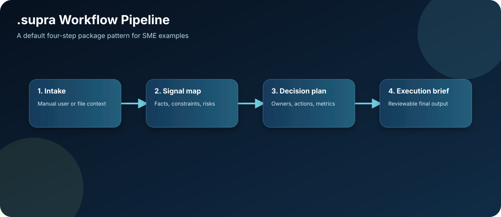

# `.supra` Example Documentation

Generated German and English Markdown documentation for every `.supra` package in this repository.
Descriptions are read from the source package metadata and `scripts/data/*.json`, so this catalog stays aligned with the importable examples.

Generierte deutsche und englische Dokumentation für jedes `.supra`-Paket in diesem Repository. Die Paketdokumente liegen unter [`packages/`](packages/), gruppiert nach Domäne.



**147 packages / Pakete** in 12 domains / Domänen.

## Compliance, Risk & ESG / Compliance, Risiko & ESG

Folder / Ordner: [`packages/compliance_risk_esg/`](../packages/compliance_risk_esg/README.md) — 12 packages

| Package                                  | Description / Beschreibung                                                                                                                                                                                                                                                                                                                                                                                                                                | Columns | Deutsch                                                   | English                                                   |
| ---------------------------------------- | --------------------------------------------------------------------------------------------------------------------------------------------------------------------------------------------------------------------------------------------------------------------------------------------------------------------------------------------------------------------------------------------------------------------------------------------------------- | ------- | --------------------------------------------------------- | --------------------------------------------------------- |
| SME Business Continuity Planner          | Build a business continuity plan for critical processes with impact analysis, recovery priorities, workarounds, contacts, and test schedule, sized for a small organisation.<br>_Erstellt einen Notfall- und Kontinuitätsplan für kritische Prozesse mit Auswirkungsanalyse, Wiederanlaufprioritäten, Umgehungslösungen, Kontakten und Testplan, dimensioniert für eine kleine Organisation._                                                             | 4       | [DE](packages/sme_business_continuity_planner.de.md)      | [EN](packages/sme_business_continuity_planner.en.md)      |
| SME Carbon Footprint Estimator           | Estimate a first scope 1 and 2 carbon footprint from energy, fuel, and fleet data with transparent factors and assumptions, and list scope 3 hotspots to investigate.<br>_Schätzt aus Energie-, Kraftstoff- und Flottendaten einen ersten Scope-1- und Scope-2-CO2-Fußabdruck mit transparenten Faktoren und Annahmen und listet zu untersuchende Scope-3-Hotspots auf._                                                                                  | 4       | [DE](packages/sme_carbon_footprint_estimator.de.md)       | [EN](packages/sme_carbon_footprint_estimator.en.md)       |
| SME Compliance Evidence Pack             | Organize compliance facts into an evidence pack that highlights obligations, proof gaps, owners, deadlines, and reviewer-ready notes.<br>_Strukturiert Compliance-Fakten zu einem Evidenzpaket mit Pflichten, Nachweislücken, Verantwortlichen, Fristen und prüfbereiten Hinweisen._                                                                                                                                                                      | 4       | [DE](packages/sme_compliance_evidence_pack.de.md)         | [EN](packages/sme_compliance_evidence_pack.en.md)         |
| SME Contract Clause Risk Scanner         | Scan a contract draft for risky clauses such as liability, termination, payment terms, IP, and exclusivity, explain the business impact in plain language, and list negotiation points for legal review.<br>_Prüft einen Vertragsentwurf auf riskante Klauseln wie Haftung, Kündigung, Zahlungsbedingungen, geistiges Eigentum und Exklusivität, erklärt die geschäftliche Wirkung verständlich und listet Verhandlungspunkte für die Rechtsprüfung auf._ | 4       | [DE](packages/sme_contract_clause_risk_scanner.de.md)     | [EN](packages/sme_contract_clause_risk_scanner.en.md)     |
| SME Cyber Hygiene Action Board           | Convert cyber hygiene observations into a prioritized remediation board with risk level, responsible owners, due dates, and verification checks.<br>_Überführt Cyber-Hygiene-Beobachtungen in ein priorisiertes Remediation-Board mit Risikostufe, verantwortlichen Personen, Fristen und Verifikationschecks._                                                                                                                                           | 4       | [DE](packages/sme_cyber_hygiene_action_board.de.md)       | [EN](packages/sme_cyber_hygiene_action_board.en.md)       |
| SME ESG Supplier Questionnaire Responder | Prepare answers to a customer's sustainability or supply-chain questionnaire from available company evidence, mark gaps honestly, and plan the evidence to collect next.<br>_Bereitet Antworten auf den Nachhaltigkeits- oder Lieferkettenfragebogen eines Kunden aus vorhandenen Unternehmensnachweisen vor, markiert Lücken ehrlich und plant die als Nächstes zu sammelnden Nachweise._                                                                | 4       | [DE](packages/sme_esg_supplier_questionnaire.de.md)       | [EN](packages/sme_esg_supplier_questionnaire.en.md)       |
| SME ESG Sustainability Copilot           | Consolidate sustainability evidence into an ESG readiness scorecard, gap analysis and action plan.<br>_Konsolidiert Nachhaltigkeitsnachweise zu einer ESG-Readiness-Scorecard mit Gap-Analyse und Maßnahmenplan._                                                                                                                                                                                                                                         | 3       | [DE](packages/sme_esg_sustainability_copilot.de.md)       | [EN](packages/sme_esg_sustainability_copilot.en.md)       |
| SME GDPR Processing Register Builder     | Build a draft record of processing activities from system and process descriptions, with purposes, data categories, legal basis candidates, retention, and items that need legal review.<br>_Erstellt aus System- und Prozessbeschreibungen ein Verzeichnis von Verarbeitungstätigkeiten im Entwurf mit Zwecken, Datenkategorien, möglichen Rechtsgrundlagen, Aufbewahrung und rechtlich zu prüfenden Punkten._                                           | 4       | [DE](packages/sme_gdpr_processing_register.de.md)         | [EN](packages/sme_gdpr_processing_register.en.md)         |
| SME Insurance Coverage Checker           | Compare business activities and assets with existing insurance policies to spot coverage gaps, overlaps, and outdated sums, and prepare questions for a broker.<br>_Gleicht Geschäftstätigkeiten und Vermögenswerte mit bestehenden Versicherungspolicen ab, um Deckungslücken, Überschneidungen und veraltete Summen zu erkennen, und bereitet Fragen für den Makler vor._                                                                               | 4       | [DE](packages/sme_insurance_coverage_checker.de.md)       | [EN](packages/sme_insurance_coverage_checker.en.md)       |
| SME Regulatory Change Impact Assessor    | Assess what a new regulation or standard means for the company, which processes and documents are affected, what the deadlines are, and which steps need expert confirmation.<br>_Bewertet, was eine neue Vorschrift oder Norm für das Unternehmen bedeutet, welche Prozesse und Dokumente betroffen sind, welche Fristen gelten und welche Schritte eine Expertenbestätigung benötigen._                                                                 | 4       | [DE](packages/sme_regulatory_change_impact.de.md)         | [EN](packages/sme_regulatory_change_impact.en.md)         |
| SME Whistleblower Case Handler           | Structure the handling of an internal report with confidentiality steps, acknowledgement timelines, investigation plan, conflict-of-interest checks, and documentation, marking legal review points.<br>_Strukturiert die Bearbeitung einer internen Meldung mit Vertraulichkeitsschritten, Bestätigungsfristen, Untersuchungsplan, Prüfung von Interessenkonflikten und Dokumentation und markiert rechtliche Prüfpunkte._                               | 4       | [DE](packages/sme_whistleblower_case_handler.de.md)       | [EN](packages/sme_whistleblower_case_handler.en.md)       |
| SME Workplace Safety Risk Assessment     | Create a structured hazard and risk assessment for a workplace or activity with likelihood, severity, existing controls, additional measures, and documentation needs.<br>_Erstellt eine strukturierte Gefährdungsbeurteilung für einen Arbeitsplatz oder eine Tätigkeit mit Wahrscheinlichkeit, Schwere, bestehenden Schutzmaßnahmen, zusätzlichen Maßnahmen und Dokumentationsbedarf._                                                                  | 4       | [DE](packages/sme_workplace_safety_risk_assessment.de.md) | [EN](packages/sme_workplace_safety_risk_assessment.en.md) |

## Customer Service / Kundenservice

Folder / Ordner: [`packages/customer_service/`](../packages/customer_service/README.md) — 10 packages

| Package                                  | Description / Beschreibung                                                                                                                                                                                                                                                                                                                                                                    | Columns | Deutsch                                                  | English                                                  |
| ---------------------------------------- | --------------------------------------------------------------------------------------------------------------------------------------------------------------------------------------------------------------------------------------------------------------------------------------------------------------------------------------------------------------------------------------------- | ------- | -------------------------------------------------------- | -------------------------------------------------------- |
| SME Complaint Root Cause Clusterer       | Cluster customer complaints into root-cause groups, estimate frequency and impact, and propose prevention actions with owners and verification checks.<br>_Gruppiert Kundenbeschwerden nach Ursachen, schätzt Häufigkeit und Auswirkung und schlägt Präventionsmaßnahmen mit Verantwortlichen und Verifikationschecks vor._                                                                   | 4       | [DE](packages/sme_complaint_root_cause_clusterer.de.md)  | [EN](packages/sme_complaint_root_cause_clusterer.en.md)  |
| SME Customer Health Scoring              | Define a simple customer health score from usage, support, payment, and relationship signals, classify current accounts, and propose actions per health band.<br>_Definiert einen einfachen Kundengesundheits-Score aus Nutzungs-, Support-, Zahlungs- und Beziehungssignalen, klassifiziert bestehende Accounts und schlägt Maßnahmen je Gesundheitsstufe vor._                              | 4       | [DE](packages/sme_customer_health_scoring.de.md)         | [EN](packages/sme_customer_health_scoring.en.md)         |
| SME Customer Onboarding Journey Designer | Design a customer onboarding journey with milestones, communications, success checks, and early-warning signals, based on where customers currently get stuck.<br>_Entwirft eine Kunden-Onboarding-Journey mit Meilensteinen, Kommunikation, Erfolgsprüfungen und Frühwarnsignalen auf Basis der Stellen, an denen Kunden heute stecken bleiben._                                             | 4       | [DE](packages/sme_customer_onboarding_journey.de.md)     | [EN](packages/sme_customer_onboarding_journey.en.md)     |
| SME Customer Reply                       | Draft a professional customer response that balances tone, facts, evidence gaps, commitments, and follow-up checks for sensitive service situations.<br>_Entwirft eine professionelle Kundenantwort, die Ton, Fakten, Evidenzlücken, Zusagen und Follow-up-Prüfungen für sensible Servicesituationen ausbalanciert._                                                                          | 4       | [DE](packages/sme_customer_reply.de.md)                  | [EN](packages/sme_customer_reply.en.md)                  |
| SME NPS And Feedback Analyzer            | Analyse survey scores and free-text feedback for themes, drivers of promoters and detractors, and actionable follow-ups, without over-reading small samples.<br>_Analysiert Umfragewerte und Freitext-Feedback auf Themen, Treiber von Promotoren und Kritikern und umsetzbare Follow-ups, ohne kleine Stichproben zu überinterpretieren._                                                    | 4       | [DE](packages/sme_nps_feedback_analyzer.de.md)           | [EN](packages/sme_nps_feedback_analyzer.en.md)           |
| SME Returns And Refund Policy Optimizer  | Review return data and current policy to balance customer trust, fraud risk, cost, and legal minimums, and propose policy wording, process changes, and metrics.<br>_Prüft Retourendaten und die aktuelle Richtlinie, um Kundenvertrauen, Missbrauchsrisiko, Kosten und gesetzliche Mindestanforderungen auszubalancieren, und schlägt Formulierungen, Prozessänderungen und Kennzahlen vor._ | 4       | [DE](packages/sme_returns_refund_policy_optimizer.de.md) | [EN](packages/sme_returns_refund_policy_optimizer.en.md) |
| SME Service Level Agreement Drafter      | Draft a practical SLA with service scope, response and resolution targets, exclusions, measurement, and remedies, sized to what the company can realistically deliver.<br>_Entwirft ein praxistaugliches SLA mit Leistungsumfang, Reaktions- und Lösungszeiten, Ausschlüssen, Messung und Abhilfen, dimensioniert auf das, was das Unternehmen realistisch leisten kann._                     | 4       | [DE](packages/sme_service_level_agreement_drafter.de.md) | [EN](packages/sme_service_level_agreement_drafter.en.md) |
| SME Service Recovery Playbook            | Create a service recovery playbook for a specific failure with apology framing, remedy options by severity, authority limits for staff, and follow-up verification.<br>_Erstellt für einen konkreten Servicefehler ein Wiedergutmachungs-Playbook mit Entschuldigungsrahmen, Abhilfeoptionen je Schweregrad, Entscheidungsbefugnissen für Mitarbeitende und Nachverfolgung._                  | 4       | [DE](packages/sme_service_recovery_playbook.de.md)       | [EN](packages/sme_service_recovery_playbook.en.md)       |
| SME Support Ticket Triage Rules          | Derive triage categories, priority rules, routing, and canned first responses from historical tickets, and define escalation thresholds and quality checks.<br>_Leitet aus historischen Tickets Triage-Kategorien, Prioritätsregeln, Routing und Erstantwort-Vorlagen ab und definiert Eskalationsschwellen und Qualitätschecks._                                                             | 4       | [DE](packages/sme_support_ticket_triage_rules.de.md)     | [EN](packages/sme_support_ticket_triage_rules.en.md)     |
| SME Warranty Root Cause Radar            | Analyze warranty issues to propose root-cause hypotheses, containment actions, evidence gaps, customer impact notes, and prevention checks.<br>_Analysiert Garantieprobleme und schlägt Root-Cause-Hypothesen, Containment-Maßnahmen, Evidenzlücken, Kundenwirkung und Präventionschecks vor._                                                                                                | 4       | [DE](packages/sme_warranty_root_cause_radar.de.md)       | [EN](packages/sme_warranty_root_cause_radar.en.md)       |

## Education & Learning / Bildung & Lernen

Folder / Ordner: [`packages/education_learning/`](../packages/education_learning/README.md) — 7 packages

| Package                                  | Description / Beschreibung                                                                                                                                                                                                                                                                                                                                                                              | Columns | Deutsch                                                | English                                                |
| ---------------------------------------- | ------------------------------------------------------------------------------------------------------------------------------------------------------------------------------------------------------------------------------------------------------------------------------------------------------------------------------------------------------------------------------------------------------- | ------- | ------------------------------------------------------ | ------------------------------------------------------ |
| MINT Study Planning                      | Generate structured MINT/STEM study plans from learner goals, baseline skills, schedule, constraints, milestones, resources, and assessments.<br>_Erstellt strukturierte MINT/STEM-Lernpläne aus Lernzielen, Ausgangskompetenzen, Zeitplan, Einschränkungen, Meilensteinen, Ressourcen und Assessments._                                                                                                | 4       | [DE](packages/mint_study_planning.de.md)               | [EN](packages/mint_study_planning.en.md)               |
| SME Customer Training Curriculum Builder | Design a customer or partner training curriculum from product knowledge and support questions with modules, learning objectives, formats, assessments, and maintenance plan.<br>_Entwirft aus Produktwissen und Supportfragen ein Kunden- oder Partnerschulungscurriculum mit Modulen, Lernzielen, Formaten, Prüfungen und Pflegeplan._                                                                 | 4       | [DE](packages/sme_customer_training_curriculum.de.md)  | [EN](packages/sme_customer_training_curriculum.en.md)  |
| SME Expert Knowledge Capture Interviewer | Generate a structured interview guide and knowledge map to capture a departing expert's tacit knowledge, prioritizing critical, rarely used, and undocumented know-how.<br>_Erzeugt einen strukturierten Interviewleitfaden und eine Wissenslandkarte, um das implizite Wissen einer ausscheidenden Fachkraft zu sichern, priorisiert nach kritischem, selten genutztem und undokumentiertem Know-how._ | 4       | [DE](packages/sme_expert_knowledge_capture.de.md)      | [EN](packages/sme_expert_knowledge_capture.en.md)      |
| SME Knowledge Base Article Writer        | Convert support answers and expert notes into clear knowledge base articles with problem statement, steps, screenshots to add, related articles, and review owner.<br>_Wandelt Supportantworten und Expertennotizen in klare Wissensdatenbank-Artikel mit Problembeschreibung, Schritten, zu ergänzenden Screenshots, verwandten Artikeln und Prüfverantwortlichem um._                                 | 4       | [DE](packages/sme_knowledge_base_article_writer.de.md) | [EN](packages/sme_knowledge_base_article_writer.en.md) |
| SME Project Lessons Learned Facilitator  | Prepare and structure a project retrospective with timeline reconstruction, what worked, what failed, root causes, and reusable practices, converting them into checklist updates.<br>_Bereitet eine Projekt-Retrospektive mit Zeitstrahl-Rekonstruktion, Erfolgen, Fehlschlägen, Ursachen und wiederverwendbaren Praktiken vor und überführt diese in Checklisten-Updates._                            | 4       | [DE](packages/sme_lessons_learned_facilitator.de.md)   | [EN](packages/sme_lessons_learned_facilitator.en.md)   |
| SME Mentoring Program Designer           | Design an internal mentoring program with matching criteria, meeting cadence, goals, confidentiality rules, and evaluation, sized to a small team's capacity.<br>_Entwirft ein internes Mentoring-Programm mit Matching-Kriterien, Treffrhythmus, Zielen, Vertraulichkeitsregeln und Evaluation, dimensioniert auf die Kapazität eines kleinen Teams._                                                  | 4       | [DE](packages/sme_mentoring_program_designer.de.md)    | [EN](packages/sme_mentoring_program_designer.en.md)    |
| SME Micro-Learning Series Planner        | Plan a series of short learning units for staff on a specific topic with objectives, sequencing, formats, practice tasks, and knowledge checks that fit into daily work.<br>_Plant eine Serie kurzer Lerneinheiten für Mitarbeitende zu einem Thema mit Zielen, Reihenfolge, Formaten, Übungsaufgaben und Wissenschecks, die in den Arbeitsalltag passen._                                              | 4       | [DE](packages/sme_micro_learning_series_planner.de.md) | [EN](packages/sme_micro_learning_series_planner.en.md) |

## Finance & Cash / Finanzen & Liquidität

Folder / Ordner: [`packages/finance_cash/`](../packages/finance_cash/README.md) — 16 packages

| Package                                    | Description / Beschreibung                                                                                                                                                                                                                                                                                                                                                                                           | Columns | Deutsch                                                   | English                                                   |
| ------------------------------------------ | -------------------------------------------------------------------------------------------------------------------------------------------------------------------------------------------------------------------------------------------------------------------------------------------------------------------------------------------------------------------------------------------------------------------- | ------- | --------------------------------------------------------- | --------------------------------------------------------- |
| SME Bank Loan Readiness Pack               | Assemble a bank-ready financing brief from business facts, financial signals, collateral notes, and use of funds, and list the evidence a lender will ask for.<br>_Stellt aus Geschäftsfakten, Finanzsignalen, Sicherheitenhinweisen und Mittelverwendung ein bankfähiges Finanzierungsbriefing zusammen und listet die Nachweise auf, die ein Kreditgeber verlangen wird._                                          | 4       | [DE](packages/sme_bank_loan_readiness_pack.de.md)         | [EN](packages/sme_bank_loan_readiness_pack.en.md)         |
| SME Budget Variance Explainer              | Explain budget-versus-actual variances by line item, separate one-off effects from structural drift, and propose reforecast actions with owners.<br>_Erklärt Plan-Ist-Abweichungen je Position, trennt Einmaleffekte von strukturellen Verschiebungen und schlägt Reforecast-Maßnahmen mit Verantwortlichen vor._                                                                                                    | 4       | [DE](packages/sme_budget_variance_explainer.de.md)        | [EN](packages/sme_budget_variance_explainer.en.md)        |
| SME Cashflow War Room                      | Prioritize cashflow risks from receivables, payables, and commitments, then convert them into an owner-ready recovery board with escalation triggers.<br>_Priorisiert Cashflow-Risiken aus Forderungen, Verbindlichkeiten und Zusagen und überführt sie in ein verantwortbares Recovery-Board mit Eskalationstriggern._                                                                                              | 4       | [DE](packages/sme_cashflow_war_room.de.md)                | [EN](packages/sme_cashflow_war_room.en.md)                |
| SME Cost-Cutting Scenario Planner          | Model cost-reduction scenarios with savings, timing, operational side effects, and reversibility, and recommend a sequenced plan that protects revenue and people.<br>_Modelliert Kostensenkungsszenarien mit Einsparungen, Timing, operativen Nebenwirkungen und Reversibilität und empfiehlt einen sequenzierten Plan, der Umsatz und Mitarbeitende schützt._                                                      | 4       | [DE](packages/sme_cost_cutting_scenario_planner.de.md)    | [EN](packages/sme_cost_cutting_scenario_planner.en.md)    |
| SME Customer Credit Risk Screener          | Screen a new or existing customer for credit risk using payment history, order size, public signals, and contract terms, and recommend limits, prepayment, or escalation.<br>_Prüft neue oder bestehende Kunden anhand von Zahlungshistorie, Auftragsgröße, öffentlichen Signalen und Vertragsbedingungen auf Kreditrisiko und empfiehlt Limits, Vorkasse oder Eskalation._                                          | 4       | [DE](packages/sme_credit_risk_screener.de.md)             | [EN](packages/sme_credit_risk_screener.en.md)             |
| SME Energy Cost Anomaly Finder             | Spot energy-cost anomalies, separate likely drivers from assumptions, and propose reviewable savings or investigation actions with ownership.<br>_Erkennt Energiekostenanomalien, trennt wahrscheinliche Treiber von Annahmen und schlägt prüfbare Einspar- oder Untersuchungsmaßnahmen mit Ownership vor._                                                                                                          | 4       | [DE](packages/sme_energy_cost_anomaly_finder.de.md)       | [EN](packages/sme_energy_cost_anomaly_finder.en.md)       |
| SME Expense Policy Auditor                 | Review expense claims and card spend against a written policy, flag exceptions and patterns, and propose reviewable policy or control updates.<br>_Prüft Spesenabrechnungen und Kartenumsätze gegen eine schriftliche Richtlinie, markiert Ausnahmen und Muster und schlägt prüfbare Richtlinien- oder Kontrollanpassungen vor._                                                                                     | 4       | [DE](packages/sme_expense_policy_auditor.de.md)           | [EN](packages/sme_expense_policy_auditor.en.md)           |
| SME Investor And Stakeholder Update Writer | Draft a concise monthly investor or shareholder update from KPIs, wins, problems, cash runway, and asks, keeping facts separated from projections.<br>_Entwirft aus KPIs, Erfolgen, Problemen, Cash-Runway und Anfragen ein knappes monatliches Update für Investoren oder Gesellschafter und hält Fakten und Prognosen getrennt._                                                                                   | 4       | [DE](packages/sme_investor_update_writer.de.md)           | [EN](packages/sme_investor_update_writer.en.md)           |
| SME Invoice Dispute Resolver               | Structure invoice-dispute facts into a resolution plan with claim summary, evidence gaps, negotiation options, owners, and escalation triggers.<br>_Strukturiert Rechnungsstreit-Fakten zu einem Lösungsplan mit Anspruchszusammenfassung, Evidenzlücken, Verhandlungsoptionen, Verantwortlichen und Eskalationstriggern._                                                                                           | 4       | [DE](packages/sme_invoice_dispute_resolver.de.md)         | [EN](packages/sme_invoice_dispute_resolver.en.md)         |
| SME Late Payment Collector                 | Prepare a humane but firm late-payment collection plan with customer context, message drafts, escalation path, and payment-risk signals.<br>_Bereitet einen menschlichen, aber klaren Mahnplan mit Kundenkontext, Nachrichtenvorlagen, Eskalationspfad und Zahlungsrisikosignalen vor._                                                                                                                              | 4       | [DE](packages/sme_late_payment_collector.de.md)           | [EN](packages/sme_late_payment_collector.en.md)           |
| SME Margin Leak Detector                   | Identify margin leakage from pricing, discounting, cost, and delivery signals, then create a practical profit-protection action plan.<br>_Erkennt Margenverluste aus Preis-, Rabatt-, Kosten- und Liefersignalen und erstellt daraus einen praxisnahen Gewinnschutzplan._                                                                                                                                            | 4       | [DE](packages/sme_margin_leak_detector.de.md)             | [EN](packages/sme_margin_leak_detector.en.md)             |
| SME Pricing Power Simulator                | Assess pricing power using demand, competition, cost, and customer signals, then propose scenarios, guardrails, and review triggers.<br>_Bewertet Preissetzungsmacht anhand von Nachfrage-, Wettbewerbs-, Kosten- und Kundensignalen und schlägt Szenarien, Guardrails und Review-Trigger vor._                                                                                                                      | 4       | [DE](packages/sme_pricing_power_simulator.de.md)          | [EN](packages/sme_pricing_power_simulator.en.md)          |
| SME Quote-to-Cash Bottleneck Scanner       | Scan quote-to-cash flow for handoff bottlenecks, missing data, aging risks, and owner-ready fixes that protect revenue timing.<br>_Prüft den Quote-to-Cash-Prozess auf Übergabeengpässe, fehlende Daten, Aging-Risiken und verantwortbare Maßnahmen zum Schutz des Umsatzzeitpunkts._                                                                                                                                | 4       | [DE](packages/sme_quote_to_cash_bottleneck.de.md)         | [EN](packages/sme_quote_to_cash_bottleneck.en.md)         |
| SME Subscription Billing Leak Finder       | Find revenue leakage in recurring billing such as unbilled seats, failed renewals, expired discounts, and mismatches between contract and invoice, then propose fixes and controls.<br>_Findet Umsatzlecks in wiederkehrender Abrechnung wie nicht abgerechnete Nutzer, gescheiterte Verlängerungen, abgelaufene Rabatte und Abweichungen zwischen Vertrag und Rechnung und schlägt Korrekturen und Kontrollen vor._ | 4       | [DE](packages/sme_subscription_billing_leak_finder.de.md) | [EN](packages/sme_subscription_billing_leak_finder.en.md) |
| SME 13-Week Cash Forecast Builder          | Turn bank balances, open invoices, payables, payroll dates, and known commitments into a reviewable 13-week cash forecast with weekly gaps, assumptions, and owner actions.<br>_Wandelt Kontostände, offene Rechnungen, Verbindlichkeiten, Gehaltstermine und bekannte Zusagen in eine prüfbare 13-Wochen-Liquiditätsvorschau mit Wochenlücken, Annahmen und Owner-Maßnahmen um._                                    | 4       | [DE](packages/sme_thirteen_week_cash_forecast.de.md)      | [EN](packages/sme_thirteen_week_cash_forecast.en.md)      |
| SME Unit Economics Checker                 | Compute and sanity-check contribution margin, customer acquisition cost, payback, and break-even per product or customer segment, with explicit assumptions and evidence gaps.<br>_Berechnet und plausibilisiert Deckungsbeitrag, Kundenakquisitionskosten, Payback und Break-even je Produkt oder Kundensegment mit expliziten Annahmen und Evidenzlücken._                                                         | 4       | [DE](packages/sme_unit_economics_checker.de.md)           | [EN](packages/sme_unit_economics_checker.en.md)           |

## IT, Digital & Data / IT, Digitalisierung & Daten

Folder / Ordner: [`packages/it_digital_data/`](../packages/it_digital_data/README.md) — 11 packages

| Package                                   | Description / Beschreibung                                                                                                                                                                                                                                                                                                                                                                                   | Columns | Deutsch                                                        | English                                                        |
| ----------------------------------------- | ------------------------------------------------------------------------------------------------------------------------------------------------------------------------------------------------------------------------------------------------------------------------------------------------------------------------------------------------------------------------------------------------------------ | ------- | -------------------------------------------------------------- | -------------------------------------------------------------- |
| SME AI Adoption Readiness Sprint          | Assess SME AI adoption readiness and turn constraints, data quality, risks, and team capacity into a concrete first-sprint action plan.<br>_Bewertet die KI-Einführungsreife eines KMU und übersetzt Einschränkungen, Datenqualität, Risiken und Teamkapazität in einen konkreten ersten Sprintplan._                                                                                                        | 4       | [DE](packages/sme_ai_adoption_readiness_sprint.de.md)          | [EN](packages/sme_ai_adoption_readiness_sprint.en.md)          |
| SME AI Use Policy Drafter                 | Draft a practical internal AI usage policy with allowed and prohibited uses, data handling rules, review duties, tool approval, and training needs, marking points for legal review.<br>_Entwirft eine praxisnahe interne Richtlinie zur KI-Nutzung mit erlaubten und verbotenen Anwendungen, Datenregeln, Prüfpflichten, Tool-Freigabe und Schulungsbedarf und markiert rechtliche Prüfpunkte._             | 4       | [DE](packages/sme_ai_use_policy_drafter.de.md)                 | [EN](packages/sme_ai_use_policy_drafter.en.md)                 |
| SME Customer Data Deduplication Planner   | Plan the deduplication and merge of customer records across systems with matching rules, survivorship logic, exception handling, and a validation sample before bulk changes.<br>_Plant die Bereinigung und Zusammenführung von Kundendatensätzen über Systeme hinweg mit Abgleichregeln, Survivorship-Logik, Ausnahmebehandlung und einer Validierungsstichprobe vor Massenänderungen._                     | 4       | [DE](packages/sme_customer_data_deduplication.de.md)           | [EN](packages/sme_customer_data_deduplication.en.md)           |
| SME Backup And Recovery Check             | Assess backup coverage, frequency, retention, offsite copies, and restore testing against the company's tolerance for data loss and downtime, and propose a prioritized fix list.<br>_Bewertet Backup-Abdeckung, Häufigkeit, Aufbewahrung, externe Kopien und Wiederherstellungstests gegenüber der Toleranz des Unternehmens für Datenverlust und Ausfallzeit und schlägt eine priorisierte Fix-Liste vor._ | 4       | [DE](packages/sme_data_backup_recovery_check.de.md)            | [EN](packages/sme_data_backup_recovery_check.en.md)            |
| SME Data Cleanup Command Center           | Create a practical data cleanup plan with issue categories, quality rules, owners, validation checks, and a sequence for remediation.<br>_Erstellt einen praxisnahen Datenbereinigungsplan mit Problemkategorien, Qualitätsregeln, Verantwortlichen, Validierungschecks und Umsetzungsreihenfolge._                                                                                                          | 4       | [DE](packages/sme_data_cleanup_command_center.de.md)           | [EN](packages/sme_data_cleanup_command_center.en.md)           |
| SME Digital Maturity Assessment           | Assess digital maturity across processes, data, tools, skills, and security from a self-description, and produce a realistic 12-month roadmap with quick wins and prerequisites.<br>_Bewertet die digitale Reife in Prozessen, Daten, Tools, Kompetenzen und Sicherheit anhand einer Selbstbeschreibung und erstellt eine realistische 12-Monats-Roadmap mit Quick Wins und Voraussetzungen._                | 4       | [DE](packages/sme_digital_maturity_assessment.de.md)           | [EN](packages/sme_digital_maturity_assessment.en.md)           |
| SME IT Asset Lifecycle Planner            | Plan hardware and licence replacements from an asset inventory with age, support status, and cost, producing a budgeted refresh schedule and risk flags for unsupported systems.<br>_Plant Hardware- und Lizenzersatz aus einem Bestandsverzeichnis mit Alter, Supportstatus und Kosten und erstellt einen budgetierten Erneuerungsplan mit Risikohinweisen für nicht mehr unterstützte Systeme._            | 4       | [DE](packages/sme_it_asset_lifecycle_planner.de.md)            | [EN](packages/sme_it_asset_lifecycle_planner.en.md)            |
| SME Access And Password Review            | Review user accounts, shared credentials, admin rights, and leaver handling against least-privilege principles, and produce a prioritized cleanup and control plan.<br>_Prüft Benutzerkonten, geteilte Zugangsdaten, Administratorrechte und Austrittsprozesse nach dem Prinzip der minimalen Rechte und erstellt einen priorisierten Bereinigungs- und Kontrollplan._                                       | 4       | [DE](packages/sme_password_access_review.de.md)                | [EN](packages/sme_password_access_review.en.md)                |
| SME Process Automation Opportunity Finder | Identify repetitive manual tasks suitable for automation from process descriptions, estimate time savings and effort, and rank candidates with risks and prerequisites.<br>_Erkennt aus Prozessbeschreibungen wiederkehrende manuelle Aufgaben, die sich für Automatisierung eignen, schätzt Zeitersparnis und Aufwand und priorisiert Kandidaten mit Risiken und Voraussetzungen._                          | 4       | [DE](packages/sme_process_automation_opportunity_finder.de.md) | [EN](packages/sme_process_automation_opportunity_finder.en.md) |
| SME Software Selection Matrix             | Turn requirements and vendor information into a weighted selection matrix with must-have gates, total cost of ownership, migration risk, and a recommended shortlist.<br>_Wandelt Anforderungen und Anbieterinformationen in eine gewichtete Auswahlmatrix mit K.-o.-Kriterien, Gesamtbetriebskosten, Migrationsrisiko und einer empfohlenen Shortlist um._                                                  | 4       | [DE](packages/sme_software_selection_matrix.de.md)             | [EN](packages/sme_software_selection_matrix.en.md)             |
| SME Website Analytics Interpreter         | Interpret website analytics exports for traffic, conversion, and content signals, separate real trends from noise, and propose next experiments with success criteria.<br>_Interpretiert Website-Analytics-Exporte nach Traffic-, Conversion- und Content-Signalen, trennt echte Trends von Rauschen und schlägt nächste Experimente mit Erfolgskriterien vor._                                              | 4       | [DE](packages/sme_website_analytics_interpreter.de.md)         | [EN](packages/sme_website_analytics_interpreter.en.md)         |

## Marketing & Content / Marketing & Content

Folder / Ordner: [`packages/marketing_content/`](../packages/marketing_content/README.md) — 12 packages

| Package                             | Description / Beschreibung                                                                                                                                                                                                                                                                                                                                                        | Columns | Deutsch                                                  | English                                                  |
| ----------------------------------- | --------------------------------------------------------------------------------------------------------------------------------------------------------------------------------------------------------------------------------------------------------------------------------------------------------------------------------------------------------------------------------- | ------- | -------------------------------------------------------- | -------------------------------------------------------- |
| LinkedIn Extreme Engagement Posting | Create a high-engagement LinkedIn publishing package with hooks, post variants, positioning notes, risk checks, and engagement follow-up prompts.<br>_Erstellt ein LinkedIn-Publishing-Paket für hohe Interaktion mit Hooks, Post-Varianten, Positionierungsnotizen, Risikoprüfungen und Follow-up-Impulsen._                                                                     | 9       | [DE](packages/linkedin_extreme_engagement_posting.de.md) | [EN](packages/linkedin_extreme_engagement_posting.en.md) |
| SME Ad Campaign Brief Builder       | Build a paid campaign brief with objective, audience, offer, creative angles, budget split, tracking plan, and kill criteria, with assumptions and evidence gaps made explicit.<br>_Erstellt ein Briefing für bezahlte Kampagnen mit Ziel, Zielgruppe, Angebot, Kreativansätzen, Budgetaufteilung, Tracking-Plan und Abbruchkriterien mit expliziten Annahmen und Evidenzlücken._ | 4       | [DE](packages/sme_ad_campaign_brief_builder.de.md)       | [EN](packages/sme_ad_campaign_brief_builder.en.md)       |
| SME Brand Messaging Kit             | Create a compact messaging kit with positioning statement, value pillars, proof points, tone rules, and do-not-say list derived from company facts and customer language.<br>_Erstellt aus Unternehmensfakten und Kundensprache ein kompaktes Messaging-Kit mit Positionierung, Wertsäulen, Nachweisen, Tonalitätsregeln und einer Liste unerwünschter Formulierungen._           | 4       | [DE](packages/sme_brand_messaging_kit.de.md)             | [EN](packages/sme_brand_messaging_kit.en.md)             |
| SME Customer Case Study Writer      | Draft a customer case study from project notes and interview fragments with challenge, approach, measurable outcome, quotes marked for approval, and a fact-check list.<br>_Entwirft aus Projektnotizen und Interviewfragmenten eine Kundenreferenz mit Herausforderung, Vorgehen, messbarem Ergebnis, freigabepflichtigen Zitaten und einer Faktencheck-Liste._                  | 4       | [DE](packages/sme_case_study_writer.de.md)               | [EN](packages/sme_case_study_writer.en.md)               |
| SME Event Promotion Planner         | Plan promotion for a workshop, open house, or webinar with channel timeline, messages, registration funnel, reminder cadence, and post-event follow-up.<br>_Plant die Bewerbung eines Workshops, Tags der offenen Tür oder Webinars mit Kanalzeitplan, Botschaften, Registrierungsfunnel, Erinnerungsrhythmus und Nachbereitung._                                                 | 4       | [DE](packages/sme_event_promotion_planner.de.md)         | [EN](packages/sme_event_promotion_planner.en.md)         |
| SME Local SEO Content Engine        | Generate local SEO content briefs from business context, service areas, customer proof points, search intent, and page-level action notes.<br>_Erstellt lokale SEO-Content-Briefings aus Geschäftskontext, Servicegebieten, Kundennachweisen, Suchintention und seitenbezogenen Handlungshinweisen._                                                                              | 4       | [DE](packages/sme_local_seo_content_engine.de.md)        | [EN](packages/sme_local_seo_content_engine.en.md)        |
| SME Marketing Budget Allocator      | Allocate a marketing budget across channels based on past performance, goals, and constraints, with scenario ranges, test reserves, and review triggers.<br>_Verteilt ein Marketingbudget anhand vergangener Performance, Zielen und Einschränkungen auf Kanäle, mit Szenariobandbreiten, Testreserven und Review-Triggern._                                                      | 4       | [DE](packages/sme_marketing_budget_allocator.de.md)      | [EN](packages/sme_marketing_budget_allocator.en.md)      |
| SME Newsletter Content Planner      | Plan a quarter of newsletter issues with topics, audience goals, calls to action, source material needs, and measurement, grounded in existing content and customer questions.<br>_Plant ein Quartal an Newsletter-Ausgaben mit Themen, Zielgruppenzielen, Handlungsaufforderungen, Materialbedarf und Messung auf Basis vorhandener Inhalte und Kundenfragen._                   | 4       | [DE](packages/sme_newsletter_content_planner.de.md)      | [EN](packages/sme_newsletter_content_planner.en.md)      |
| SME Product Description Generator   | Generate consistent, fact-based product descriptions for shop or catalogue use from specification data, with benefit framing, SEO terms, and flags for missing attributes.<br>_Erzeugt aus Spezifikationsdaten konsistente, faktenbasierte Produktbeschreibungen für Shop oder Katalog mit Nutzenargumentation, SEO-Begriffen und Hinweisen auf fehlende Attribute._              | 4       | [DE](packages/sme_product_description_generator.de.md)   | [EN](packages/sme_product_description_generator.en.md)   |
| SME Review Reputation Responder     | Draft review responses and reputation recovery actions with evidence-aware tone, escalation guidance, service signals, and follow-up checks.<br>_Entwirft Review-Antworten und Reputationsmaßnahmen mit evidenzbewusstem Ton, Eskalationshinweisen, Servicesignalen und Follow-up-Prüfungen._                                                                                     | 4       | [DE](packages/sme_review_reputation_responder.de.md)     | [EN](packages/sme_review_reputation_responder.en.md)     |
| SME Social Media Crisis Responder   | Assess a negative social media situation, classify severity, draft holding and follow-up statements, define who approves what, and set monitoring and escalation rules.<br>_Bewertet eine negative Social-Media-Situation, klassifiziert den Schweregrad, entwirft Erst- und Folgestatements, legt Freigaben fest und definiert Monitoring- und Eskalationsregeln._               | 4       | [DE](packages/sme_social_media_crisis_responder.de.md)   | [EN](packages/sme_social_media_crisis_responder.en.md)   |
| SME Website Copy Refresher          | Rewrite key website sections for clarity and conversion using company facts and customer language, keeping every claim traceable and marking claims that need proof.<br>_Überarbeitet zentrale Website-Abschnitte für Klarheit und Conversion auf Basis von Unternehmensfakten und Kundensprache, hält jede Aussage nachvollziehbar und markiert belegpflichtige Behauptungen._   | 4       | [DE](packages/sme_website_copy_refresher.de.md)          | [EN](packages/sme_website_copy_refresher.en.md)          |

## Operations & Production / Betrieb & Produktion

Folder / Ordner: [`packages/operations_production/`](../packages/operations_production/README.md) — 15 packages

| Package                              | Description / Beschreibung                                                                                                                                                                                                                                                                                                                                                                                         | Columns | Deutsch                                                   | English                                                   |
| ------------------------------------ | ------------------------------------------------------------------------------------------------------------------------------------------------------------------------------------------------------------------------------------------------------------------------------------------------------------------------------------------------------------------------------------------------------------------ | ------- | --------------------------------------------------------- | --------------------------------------------------------- |
| Field Service Maintenance Report     | Turn technician voice notes or transcripts into a traceable maintenance report and customer summary.<br>_Wandelt Technikernotizen oder Transkripte in einen nachvollziehbaren Wartungsbericht mit Kunden-Zusammenfassung um._                                                                                                                                                                                      | 4       | [DE](packages/field_service_maintenance_report.de.md)     | [EN](packages/field_service_maintenance_report.en.md)     |
| SME Capacity Planning Assistant      | Compare demand forecasts with available labour and machine capacity, identify shortfalls by week, and propose overtime, subcontracting, hiring, or sequencing options with cost notes.<br>_Vergleicht Nachfrageprognosen mit verfügbarer Personal- und Maschinenkapazität, erkennt wöchentliche Engpässe und schlägt Überstunden, Fremdvergabe, Einstellungen oder Reihenfolgeoptionen mit Kostenhinweisen vor._   | 4       | [DE](packages/sme_capacity_planning_assistant.de.md)      | [EN](packages/sme_capacity_planning_assistant.en.md)      |
| SME Changeover Time Reducer          | Analyse a changeover or setup process, separate internal from external steps, and propose a SMED-style plan with expected time savings, tooling needs, and verification runs.<br>_Analysiert einen Rüst- oder Umstellprozess, trennt interne von externen Schritten und schlägt einen SMED-Plan mit erwarteter Zeitersparnis, Werkzeugbedarf und Verifikationsläufen vor._                                         | 4       | [DE](packages/sme_changeover_time_reducer.de.md)          | [EN](packages/sme_changeover_time_reducer.en.md)          |
| SME Downtime Triage                  | Diagnose downtime context and create a focused triage plan that separates immediate fixes, root-cause hypotheses, prevention actions, and owners.<br>_Diagnostiziert Ausfallkontext und erstellt einen fokussierten Triageplan, der Sofortmaßnahmen, Root-Cause-Hypothesen, Prävention und Verantwortliche trennt._                                                                                                | 4       | [DE](packages/sme_downtime_triage.de.md)                  | [EN](packages/sme_downtime_triage.en.md)                  |
| SME Field Service Route Optimizer    | Turn service jobs, technician capacity, travel constraints, and priority rules into a route-optimization action brief for field teams.<br>_Wandelt Serviceaufträge, Techniker-Kapazitäten, Reiserestriktionen und Prioritätsregeln in ein Routenoptimierungs-Briefing für Außendienstteams um._                                                                                                                    | 4       | [DE](packages/sme_field_service_route_optimizer.de.md)    | [EN](packages/sme_field_service_route_optimizer.en.md)    |
| SME Fleet Utilization Optimizer      | Review vehicle or equipment utilization, idle time, and cost per unit to propose right-sizing, sharing, replacement, or scheduling changes with payback estimates.<br>_Prüft Auslastung, Leerlaufzeiten und Stückkosten von Fahrzeugen oder Geräten und schlägt Anpassungen der Flottengröße, Sharing, Ersatz oder Planungsänderungen mit Amortisationsschätzungen vor._                                           | 4       | [DE](packages/sme_fleet_utilization_optimizer.de.md)      | [EN](packages/sme_fleet_utilization_optimizer.en.md)      |
| SME Corrective Action Tracker        | Turn audit findings, incidents, and customer claims into a corrective and preventive action list with priority, owner, due date, evidence of closure, and effectiveness check.<br>_Wandelt Auditfeststellungen, Vorfälle und Kundenreklamationen in eine Korrektur- und Vorbeugungsmaßnahmenliste mit Priorität, Verantwortlichem, Frist, Abschlussnachweis und Wirksamkeitsprüfung um._                           | 4       | [DE](packages/sme_incident_to_cap_action_tracker.de.md)   | [EN](packages/sme_incident_to_cap_action_tracker.en.md)   |
| SME Meeting Summarizer               | Summarize meeting notes into decisions, actions, risks, owners, due dates, evidence gaps, and follow-up prompts.<br>_Fasst Meetingnotizen zu Entscheidungen, Maßnahmen, Risiken, Verantwortlichen, Fälligkeiten, Evidenzlücken und Follow-up-Impulsen zusammen._                                                                                                                                                   | 4       | [DE](packages/sme_meeting_summarizer.de.md)               | [EN](packages/sme_meeting_summarizer.en.md)               |
| SME Preventive Maintenance Scheduler | Build a preventive maintenance plan from asset lists, failure history, and manufacturer intervals, prioritizing by risk and production impact, with checklists and ownership.<br>_Erstellt aus Anlagenlisten, Ausfallhistorie und Herstellerintervallen einen vorbeugenden Instandhaltungsplan, priorisiert nach Risiko und Produktionswirkung, mit Checklisten und Verantwortlichkeiten._                         | 4       | [DE](packages/sme_preventive_maintenance_scheduler.de.md) | [EN](packages/sme_preventive_maintenance_scheduler.en.md) |
| SME Production Bottleneck Finder     | Locate the constraining step in a production or service flow from cycle times, queues, and downtime notes, and propose capacity, sequencing, and buffer actions with expected effect.<br>_Findet den begrenzenden Schritt in einem Produktions- oder Serviceablauf anhand von Taktzeiten, Warteschlangen und Ausfallnotizen und schlägt Kapazitäts-, Reihenfolge- und Puffermaßnahmen mit erwarteter Wirkung vor._ | 4       | [DE](packages/sme_production_bottleneck_finder.de.md)     | [EN](packages/sme_production_bottleneck_finder.en.md)     |
| SME Quality Defect Pareto Analyzer   | Rank defect types by frequency and cost, link them to likely process causes, and propose containment and corrective actions with measurement and owners.<br>_Ordnet Fehlerarten nach Häufigkeit und Kosten, verknüpft sie mit wahrscheinlichen Prozessursachen und schlägt Sofort- und Korrekturmaßnahmen mit Messung und Verantwortlichen vor._                                                                   | 4       | [DE](packages/sme_quality_defect_pareto.de.md)            | [EN](packages/sme_quality_defect_pareto.en.md)            |
| SME Safety Incident Prevention Loop  | Convert safety incident notes into prevention actions with root-cause hypotheses, responsible owners, verification checks, and review triggers.<br>_Wandelt Sicherheitsvorfallnotizen in Präventionsmaßnahmen mit Root-Cause-Hypothesen, Verantwortlichen, Verifikationschecks und Review-Triggern um._                                                                                                            | 4       | [DE](packages/sme_safety_incident_prevention.de.md)       | [EN](packages/sme_safety_incident_prevention.en.md)       |
| SME Shift Handover Risk Radar        | Identify handover risks and produce a shift-ready mitigation brief with priority issues, owner checks, open questions, and escalation signals.<br>_Erkennt Übergaberisiken und erstellt ein schichtbereites Minderungsbriefing mit Prioritätsthemen, Owner-Checks, offenen Fragen und Eskalationssignalen._                                                                                                        | 4       | [DE](packages/sme_shift_handover_risk_radar.de.md)        | [EN](packages/sme_shift_handover_risk_radar.en.md)        |
| SME SOP Builder                      | Transform process context into a clear SOP with roles, inputs, steps, quality checks, exceptions, and review cadence.<br>_Wandelt Prozesskontext in eine klare SOP mit Rollen, Inputs, Schritten, Qualitätschecks, Ausnahmen und Review-Rhythmus um._                                                                                                                                                              | 4       | [DE](packages/sme_sop_builder.de.md)                      | [EN](packages/sme_sop_builder.en.md)                      |
| SME Work Instruction Writer          | Convert expert explanations into step-by-step work instructions with safety notes, quality checkpoints, required tools, and common-mistake warnings for new staff.<br>_Wandelt Expertenerklärungen in Schritt-für-Schritt-Arbeitsanweisungen mit Sicherheitshinweisen, Qualitätsprüfpunkten, benötigten Werkzeugen und Warnungen vor typischen Fehlern für neue Mitarbeitende um._                                 | 4       | [DE](packages/sme_work_instruction_writer.de.md)          | [EN](packages/sme_work_instruction_writer.en.md)          |

## People & HR / Personal & HR

Folder / Ordner: [`packages/people_hr/`](../packages/people_hr/README.md) — 13 packages

| Package                                   | Description / Beschreibung                                                                                                                                                                                                                                                                                                                                                    | Columns | Deutsch                                                 | English                                                 |
| ----------------------------------------- | ----------------------------------------------------------------------------------------------------------------------------------------------------------------------------------------------------------------------------------------------------------------------------------------------------------------------------------------------------------------------------- | ------- | ------------------------------------------------------- | ------------------------------------------------------- |
| SME Apprenticeship Program Planner        | Plan an apprenticeship or trainee program with rotation schedule, learning goals per phase, mentor roles, evaluation points, and recruiting steps sized to the company.<br>_Plant ein Ausbildungs- oder Traineeprogramm mit Rotationsplan, Lernzielen je Phase, Mentorenrollen, Bewertungspunkten und Recruiting-Schritten, dimensioniert auf das Unternehmen._               | 4       | [DE](packages/sme_apprenticeship_program_planner.de.md) | [EN](packages/sme_apprenticeship_program_planner.en.md) |
| SME Employee Retention Risk Radar         | Identify retention risks from workload, pay signals, engagement notes, and manager observations, and propose respectful, reviewable actions per risk cluster.<br>_Erkennt Bindungsrisiken aus Arbeitslast, Gehaltssignalen, Engagement-Notizen und Beobachtungen von Führungskräften und schlägt respektvolle, prüfbare Maßnahmen je Risikocluster vor._                      | 4       | [DE](packages/sme_employee_retention_risk_radar.de.md)  | [EN](packages/sme_employee_retention_risk_radar.en.md)  |
| SME Exit Interview Analyzer               | Analyse exit interview notes for recurring themes, distinguish individual from systemic causes, and propose retention improvements with owners and follow-up checks.<br>_Analysiert Austrittsgesprächsnotizen auf wiederkehrende Themen, unterscheidet individuelle von systemischen Ursachen und schlägt Bindungsverbesserungen mit Verantwortlichen und Nachprüfungen vor._ | 4       | [DE](packages/sme_exit_interview_analyzer.de.md)        | [EN](packages/sme_exit_interview_analyzer.en.md)        |
| SME Hiring Scorecard Kit                  | Create a role scorecard with success outcomes, interview signals, decision rubric, evidence prompts, and hiring risk notes for SME teams.<br>_Erstellt eine Rollen-Scorecard mit Erfolgszielen, Interview-Signalen, Entscheidungsrubrik, Evidenzfragen und Hiring-Risikohinweisen für KMU-Teams._                                                                             | 4       | [DE](packages/sme_hiring_scorecard_kit.de.md)           | [EN](packages/sme_hiring_scorecard_kit.en.md)           |
| SME Internal Announcement Writer          | Draft an internal announcement for a change such as a new policy, reorganisation, or system rollout, with clear reasons, what changes for whom, timeline, and Q&A.<br>_Entwirft eine interne Mitteilung zu einer Änderung wie einer neuen Richtlinie, Umstrukturierung oder Systemeinführung mit klaren Gründen, Auswirkungen je Gruppe, Zeitplan und Fragen und Antworten._  | 4       | [DE](packages/sme_internal_comms_announcement.de.md)    | [EN](packages/sme_internal_comms_announcement.en.md)    |
| SME Interview Question Bank               | Generate structured, role-specific interview questions with what good answers look like, scoring anchors, and legally sensitive topics to avoid.<br>_Erzeugt strukturierte, rollenspezifische Interviewfragen mit Merkmalen guter Antworten, Bewertungsankern und rechtlich sensiblen Themen, die vermieden werden müssen._                                                   | 4       | [DE](packages/sme_interview_question_bank.de.md)        | [EN](packages/sme_interview_question_bank.en.md)        |
| SME Job Description Writer                | Write a clear, inclusive job description with real responsibilities, must-have versus nice-to-have requirements, and honest working conditions from role notes and team context.<br>_Verfasst aus Rollennotizen und Teamkontext eine klare, inklusive Stellenbeschreibung mit tatsächlichen Aufgaben, Muss- und Kann-Anforderungen sowie ehrlichen Arbeitsbedingungen._       | 4       | [DE](packages/sme_job_description_writer.de.md)         | [EN](packages/sme_job_description_writer.en.md)         |
| SME Onboarding Micro-SOP Factory          | Turn onboarding context into short SOPs, role-ready checklists, common mistake warnings, and review prompts for new team members.<br>_Wandelt Onboarding-Kontext in kurze SOPs, rollenfertige Checklisten, Warnungen vor typischen Fehlern und Review-Impulse für neue Teammitglieder um._                                                                                    | 4       | [DE](packages/sme_onboarding_micro_sop_factory.de.md)   | [EN](packages/sme_onboarding_micro_sop_factory.en.md)   |
| SME Performance Review Preparer           | Prepare a balanced performance review from goals, evidence, and feedback notes, with specific examples, development suggestions, and a fair conversation outline.<br>_Bereitet aus Zielen, Belegen und Feedbacknotizen ein ausgewogenes Mitarbeitergespräch mit konkreten Beispielen, Entwicklungsvorschlägen und einer fairen Gesprächsstruktur vor._                        | 4       | [DE](packages/sme_performance_review_prep.de.md)        | [EN](packages/sme_performance_review_prep.en.md)        |
| SME Shift Roster Builder                  | Build a shift roster proposal from demand patterns, staff availability, skills, and legal rest rules, and flag conflicts, overtime risk, and fairness issues.<br>_Erstellt aus Bedarfsmustern, Verfügbarkeiten, Qualifikationen und gesetzlichen Ruhezeiten einen Schichtplanvorschlag und markiert Konflikte, Überstundenrisiken und Fairnessprobleme._                      | 4       | [DE](packages/sme_shift_roster_builder.de.md)           | [EN](packages/sme_shift_roster_builder.en.md)           |
| SME Team Training Plan Builder            | Create an annual training plan from skill gaps, certification deadlines, and budget, with prioritized courses, internal versus external delivery, and success measures.<br>_Erstellt aus Kompetenzlücken, Zertifizierungsfristen und Budget einen Jahres-Schulungsplan mit priorisierten Kursen, interner oder externer Durchführung und Erfolgsmessung._                     | 4       | [DE](packages/sme_training_plan_builder.de.md)          | [EN](packages/sme_training_plan_builder.en.md)          |
| SME Training Skill Gap Matrix             | Map training needs into a skill-gap matrix with role impact, priority learning actions, owners, and progress review prompts.<br>_Ordnet Trainingsbedarfe in eine Skill-Gap-Matrix mit Rollenwirkung, priorisierten Lernmaßnahmen, Verantwortlichen und Fortschritts-Reviews ein._                                                                                             | 4       | [DE](packages/sme_training_skill_gap_matrix.de.md)      | [EN](packages/sme_training_skill_gap_matrix.en.md)      |
| SupraWorx Workforce Intelligence Platform | Preserve expert knowledge, map competency risk, and orchestrate learning, succession, and recruiting workflows with explainable AI receipts.<br>_Bewahrt Expertenwissen, kartiert Kompetenzrisiken und orchestriert Lern-, Nachfolge- und Recruiting-Workflows mit erklärbaren KI-Belegen._                                                                                   | 9       | [DE](packages/workforce_intelligence_platform.de.md)    | [EN](packages/workforce_intelligence_platform.en.md)    |

## Public Funding & Tenders / Förderung & Ausschreibungen

Folder / Ordner: [`packages/public_funding_tenders/`](../packages/public_funding_tenders/README.md) — 10 packages

| Package                                      | Description / Beschreibung                                                                                                                                                                                                                                                                                                                                                                                                | Columns | Deutsch                                                  | English                                                  |
| -------------------------------------------- | ------------------------------------------------------------------------------------------------------------------------------------------------------------------------------------------------------------------------------------------------------------------------------------------------------------------------------------------------------------------------------------------------------------------------- | ------- | -------------------------------------------------------- | -------------------------------------------------------- |
| AE Valley Grant/Tender/Project URL Condenser | Turn grant, tender, and project URLs into a compact evidence brief that summarizes fit, bid readiness, funding risks, and next validation steps.<br>_Verdichtet Förder-, Ausschreibungs- und Projekt-URLs zu einem kompakten Evidenz-Briefing mit Fit, Angebotsreife, Finanzierungsrisiken und nächsten Validierungsschritten._                                                                                           | 17      | [DE](packages/aevalley_grant_tender_url_condenser.de.md) | [EN](packages/aevalley_grant_tender_url_condenser.en.md) |
| KMU Tender Factory                           | Parse tender PDFs into a criteria-mapped proposal draft, scoring matrix, compliance checklist, and evidence bundle for SME submissions.<br>_Analysiert Ausschreibungs-PDFs und erstellt für KMU-Angebote einen kriterienbasierten Angebotsentwurf, eine Bewertungsmatrix, eine Compliance-Checkliste und ein Evidenzpaket._                                                                                               | 5       | [DE](packages/kmu_tender_factory.de.md)                  | [EN](packages/kmu_tender_factory.en.md)                  |
| SME Funding Progress Report Writer           | Write an interim or final report for a funded project from work logs, milestones, and spend data, aligned to the funder's template, with deviations explained and evidence attached.<br>_Verfasst aus Arbeitsprotokollen, Meilensteinen und Ausgabendaten einen Zwischen- oder Abschlussbericht für ein gefördertes Projekt entlang der Vorlage des Fördergebers, mit erklärten Abweichungen und beigefügten Nachweisen._ | 4       | [DE](packages/sme_funding_report_writer.de.md)           | [EN](packages/sme_funding_report_writer.en.md)           |
| SME Grant Application Drafter                | Draft the narrative sections of a grant application from project facts and program criteria, map each claim to evidence, and list missing attachments and consortium confirmations.<br>_Entwirft die Textteile eines Förderantrags aus Projektfakten und Programmkriterien, ordnet jede Aussage einem Nachweis zu und listet fehlende Anlagen und Konsortialbestätigungen auf._                                           | 4       | [DE](packages/sme_grant_application_drafter.de.md)       | [EN](packages/sme_grant_application_drafter.en.md)       |
| SME Grant Funding Fit Radar                  | Assess grant-fit signals and produce a shortlist with eligibility notes, evidence gaps, deadlines, effort estimates, and application next steps.<br>_Bewertet Förder-Fit-Signale und erstellt eine Shortlist mit Eignungshinweisen, Evidenzlücken, Fristen, Aufwandsschätzungen und nächsten Antragsschritten._                                                                                                           | 4       | [DE](packages/sme_grant_funding_fit_radar.de.md)         | [EN](packages/sme_grant_funding_fit_radar.en.md)         |
| SME Innovation Voucher Fit Checker           | Check a planned innovation or consulting project against typical small-grant and voucher program criteria, estimate eligible costs, and list the documents and partners needed.<br>_Prüft ein geplantes Innovations- oder Beratungsprojekt gegen typische Kriterien kleiner Förder- und Gutscheinprogramme, schätzt förderfähige Kosten und listet benötigte Dokumente und Partner auf._                                  | 4       | [DE](packages/sme_innovation_voucher_finder.de.md)       | [EN](packages/sme_innovation_voucher_finder.en.md)       |
| SME Public Tender Compliance Matrix          | Extract every mandatory requirement from tender documents into a compliance matrix with status, responsible person, evidence, and deadline, and flag exclusion risks.<br>_Extrahiert jede Pflichtanforderung aus Ausschreibungsunterlagen in eine Compliance-Matrix mit Status, Verantwortlichem, Nachweis und Frist und markiert Ausschlussrisiken._                                                                     | 4       | [DE](packages/sme_public_tender_compliance_matrix.de.md) | [EN](packages/sme_public_tender_compliance_matrix.en.md) |
| SME Subcontractor Bid Consolidator           | Consolidate subcontractor quotes into a bid calculation with scope coverage checks, price normalisation, risk allowances, and open clarifications before submission.<br>_Fasst Nachunternehmerangebote zu einer Angebotskalkulation zusammen, mit Prüfung der Leistungsabdeckung, Preisnormalisierung, Risikozuschlägen und offenen Klärungspunkten vor Abgabe._                                                          | 4       | [DE](packages/sme_subcontractor_bid_consolidator.de.md)  | [EN](packages/sme_subcontractor_bid_consolidator.en.md)  |
| SME Tender Debrief Learning Log              | Turn tender award notices and debrief feedback into a learning log with scoring gaps, pricing position, missing evidence, and concrete changes for the next bid.<br>_Wandelt Zuschlagsmitteilungen und Debriefing-Feedback in ein Lernprotokoll mit Bewertungslücken, Preisposition, fehlenden Nachweisen und konkreten Änderungen für das nächste Angebot um._                                                           | 4       | [DE](packages/sme_tender_debrief_learning_log.de.md)     | [EN](packages/sme_tender_debrief_learning_log.en.md)     |
| SME Tender No-Bid Gate                       | Create a tender bid/no-bid recommendation with fit scoring, evidence gaps, delivery risks, governance notes, and next actions.<br>_Erstellt eine Bid/No-Bid-Empfehlung für Ausschreibungen mit Fit-Bewertung, Evidenzlücken, Lieferrisiken, Governance-Hinweisen und nächsten Maßnahmen._                                                                                                                                 | 4       | [DE](packages/sme_tender_no_bid_gate.de.md)              | [EN](packages/sme_tender_no_bid_gate.en.md)              |

## Sales & Growth / Vertrieb & Wachstum

Folder / Ordner: [`packages/sales_growth/`](../packages/sales_growth/README.md) — 15 packages

| Package                             | Description / Beschreibung                                                                                                                                                                                                                                                                                                                                                                           | Columns | Deutsch                                                  | English                                                  |
| ----------------------------------- | ---------------------------------------------------------------------------------------------------------------------------------------------------------------------------------------------------------------------------------------------------------------------------------------------------------------------------------------------------------------------------------------------------- | ------- | -------------------------------------------------------- | -------------------------------------------------------- |
| SME Churn Rescue Desk               | Identify churn signals from customer context and produce a practical rescue plan with root causes, owner actions, and review triggers.<br>_Erkennt Abwanderungssignale aus Kundenkontext und erstellt einen praktikablen Rettungsplan mit Ursachen, Verantwortlichenaktionen und Review-Triggern._                                                                                                   | 4       | [DE](packages/sme_churn_rescue_desk.de.md)               | [EN](packages/sme_churn_rescue_desk.en.md)               |
| SME Cold Outreach Sequencer         | Build a multi-touch outreach sequence for a defined target segment with hooks, value proof, objection handling, and stop rules, without inventing facts about prospects.<br>_Erstellt eine mehrstufige Outreach-Sequenz für ein definiertes Zielsegment mit Hooks, Wertnachweisen, Einwandbehandlung und Abbruchregeln, ohne Fakten über Interessenten zu erfinden._                                 | 4       | [DE](packages/sme_cold_outreach_sequencer.de.md)         | [EN](packages/sme_cold_outreach_sequencer.en.md)         |
| SME Discount Approval Gate          | Evaluate a requested discount against margin floor, deal size, strategic value, and precedent, and return an approve, counter, or decline recommendation with conditions.<br>_Bewertet einen beantragten Rabatt gegen Margenuntergrenze, Dealgröße, strategischen Wert und Präzedenzfälle und liefert eine Empfehlung für Freigabe, Gegenangebot oder Ablehnung mit Bedingungen._                    | 4       | [DE](packages/sme_discount_approval_gate.de.md)          | [EN](packages/sme_discount_approval_gate.en.md)          |
| SME Key Account Growth Plan         | Turn account history, stakeholder notes, and open needs into a 90-day key account plan with expansion hypotheses, relationship actions, risks, and review metrics.<br>_Wandelt Account-Historie, Stakeholder-Notizen und offene Bedarfe in einen 90-Tage-Key-Account-Plan mit Expansionshypothesen, Beziehungsmaßnahmen, Risiken und Review-Metriken um._                                            | 4       | [DE](packages/sme_key_account_growth_plan.de.md)         | [EN](packages/sme_key_account_growth_plan.en.md)         |
| SME Lead Qualifier                  | Qualify leads using fit, urgency, budget signals, risk flags, and next-best-action recommendations for practical sales follow-up.<br>_Qualifiziert Leads anhand von Fit, Dringlichkeit, Budgetsignalen, Risikoflaggen und Next-Best-Action-Empfehlungen für praktische Vertriebsnacharbeit._                                                                                                         | 4       | [DE](packages/sme_lead_qualifier.de.md)                  | [EN](packages/sme_lead_qualifier.en.md)                  |
| SME Lost Deal Post-Mortem           | Analyse lost or stalled deals for the real reasons behind the loss, separate what was controllable, and produce sales-process and offer improvements with owners.<br>_Analysiert verlorene oder festgefahrene Deals auf die tatsächlichen Verlustgründe, trennt Beeinflussbares von Unbeeinflussbarem und erstellt Verbesserungen für Vertriebsprozess und Angebot mit Verantwortlichen._            | 4       | [DE](packages/sme_lost_deal_post_mortem.de.md)           | [EN](packages/sme_lost_deal_post_mortem.en.md)           |
| SME Pricing Page Teardown           | Review a pricing page or price list for clarity, anchoring, plan differentiation, hidden friction, and trust gaps, and propose prioritized changes with expected effect.<br>_Prüft eine Preisseite oder Preisliste auf Klarheit, Ankerwirkung, Plandifferenzierung, verborgene Reibung und Vertrauenslücken und schlägt priorisierte Änderungen mit erwarteter Wirkung vor._                         | 4       | [DE](packages/sme_pricing_page_teardown.de.md)           | [EN](packages/sme_pricing_page_teardown.en.md)           |
| SME Proposal Drafter                | Draft a proposal brief with client goals, scope, assumptions, deliverables, exclusions, risks, and next-step language.<br>_Entwirft ein Angebotsbriefing mit Kundenzielen, Scope, Annahmen, Liefergegenständen, Ausschlüssen, Risiken und nächster Handlungssprache._                                                                                                                                | 4       | [DE](packages/sme_proposal_drafter.de.md)                | [EN](packages/sme_proposal_drafter.en.md)                |
| SME Referral Program Designer       | Design a referral or partner program with incentives, eligibility rules, tracking, fraud safeguards, and launch steps that fit the company's margin and customer base.<br>_Entwirft ein Empfehlungs- oder Partnerprogramm mit Anreizen, Teilnahmeregeln, Tracking, Missbrauchsschutz und Launch-Schritten, das zu Marge und Kundenbasis des Unternehmens passt._                                     | 4       | [DE](packages/sme_referral_program_designer.de.md)       | [EN](packages/sme_referral_program_designer.en.md)       |
| SME Sales Call Debrief Coach        | Turn call notes or transcripts into a structured debrief with buyer signals, unanswered questions, commitments made, next steps, and coaching points for the rep.<br>_Wandelt Gesprächsnotizen oder Transkripte in ein strukturiertes Debriefing mit Käufersignalen, offenen Fragen, gemachten Zusagen, nächsten Schritten und Coaching-Hinweisen für den Vertriebsmitarbeiter um._                  | 4       | [DE](packages/sme_sales_call_debrief_coach.de.md)        | [EN](packages/sme_sales_call_debrief_coach.en.md)        |
| SME Sales Pipeline Hygiene Check    | Audit a sales pipeline export for stale deals, missing next steps, unrealistic close dates, and stage inflation, and produce a cleanup list with owner actions and forecast impact.<br>_Prüft einen Pipeline-Export auf veraltete Deals, fehlende nächste Schritte, unrealistische Abschlussdaten und Stage-Inflation und erstellt eine Bereinigungsliste mit Owner-Maßnahmen und Forecast-Wirkung._ | 4       | [DE](packages/sme_sales_pipeline_hygiene_check.de.md)    | [EN](packages/sme_sales_pipeline_hygiene_check.en.md)    |
| SME Subscription Retention Playbook | Build a subscription retention playbook from customer signals, renewal risks, intervention actions, owners, and review metrics.<br>_Erstellt ein Retention-Playbook für Abos aus Kundensignalen, Verlängerungsrisiken, Interventionsmaßnahmen, Verantwortlichen und Review-Metriken._                                                                                                                | 4       | [DE](packages/sme_subscription_retention_playbook.de.md) | [EN](packages/sme_subscription_retention_playbook.en.md) |
| SME Trade Show ROI Planner          | Plan a trade show participation with goals, lead targets, budget, staffing, pre- and post-show actions, and a break-even calculation with explicit assumptions.<br>_Plant eine Messeteilnahme mit Zielen, Lead-Vorgaben, Budget, Personal, Vor- und Nachbereitungsmaßnahmen sowie einer Break-even-Rechnung mit expliziten Annahmen._                                                                | 4       | [DE](packages/sme_trade_show_roi_planner.de.md)          | [EN](packages/sme_trade_show_roi_planner.en.md)          |
| SME Upsell Signal Miner             | Find upsell signals in account context and convert them into account-specific offers, timing notes, risk flags, and next actions.<br>_Findet Upsell-Signale im Account-Kontext und übersetzt sie in accountspezifische Angebote, Timing-Hinweise, Risikoflaggen und nächste Maßnahmen._                                                                                                              | 4       | [DE](packages/sme_upsell_signal_miner.de.md)             | [EN](packages/sme_upsell_signal_miner.en.md)             |
| SME Webshop Conversion Rescue       | Diagnose webshop conversion problems and produce a prioritized rescue plan covering funnel signals, friction points, experiments, and owner actions.<br>_Diagnostiziert Webshop-Conversion-Probleme und erstellt einen priorisierten Rettungsplan zu Funnel-Signalen, Reibungspunkten, Experimenten und Owner-Actions._                                                                              | 4       | [DE](packages/sme_webshop_conversion_rescue.de.md)       | [EN](packages/sme_webshop_conversion_rescue.en.md)       |

## Strategy & Analytics / Strategie & Analytik

Folder / Ordner: [`packages/strategy_analytics/`](../packages/strategy_analytics/README.md) — 14 packages

| Package                                       | Description / Beschreibung                                                                                                                                                                                                                                                                                                                                                                                                         | Columns | Deutsch                                                        | English                                                        |
| --------------------------------------------- | ---------------------------------------------------------------------------------------------------------------------------------------------------------------------------------------------------------------------------------------------------------------------------------------------------------------------------------------------------------------------------------------------------------------------------------- | ------- | -------------------------------------------------------------- | -------------------------------------------------------------- |
| Data Analytics Experiment And Launch Analyzer | Turn experiment or launch notes into a decision-ready analytics review with hypothesis checks, outcome signals, risks, and follow-up instrumentation needs.<br>_Wandelt Experiment- oder Launch-Notizen in eine entscheidungsreife Analytics-Prüfung mit Hypothesenchecks, Ergebnissignalen, Risiken und offenen Instrumentierungsbedarfen um._                                                                                    | 4       | [DE](packages/data_analytics_experiment_launch_analyzer.de.md) | [EN](packages/data_analytics_experiment_launch_analyzer.en.md) |
| Data Analytics KPI Framework Designer         | Design a practical KPI framework that connects goals to metric definitions, owners, guardrails, review cadence, and adoption-ready reporting notes.<br>_Entwirft ein praxisnahes KPI-Framework, das Ziele mit Metrikdefinitionen, Verantwortlichen, Guardrails, Review-Rhythmus und reportingfähigen Hinweisen verbindet._                                                                                                         | 4       | [DE](packages/data_analytics_kpi_framework_designer.de.md)     | [EN](packages/data_analytics_kpi_framework_designer.en.md)     |
| Data Analytics KPI Operating Review           | Create a structured KPI operating review that summarizes status, risks, corrective actions, owners, and follow-up triggers for recurring business reviews.<br>_Erstellt einen strukturierten KPI-Operating-Review mit Status, Risiken, Korrekturmaßnahmen, Verantwortlichen und Follow-up-Triggern für wiederkehrende Business-Reviews._                                                                                           | 4       | [DE](packages/data_analytics_kpi_operating_review.de.md)       | [EN](packages/data_analytics_kpi_operating_review.en.md)       |
| Data Analytics Market And Opportunity Sizer   | Estimate market or opportunity size with transparent assumptions, sizing scenarios, sensitivity checks, evidence gaps, and validation priorities.<br>_Schätzt Markt- oder Chancenpotenziale mit transparenten Annahmen, Szenarien, Sensitivitätschecks, Evidenzlücken und Validierungsprioritäten._                                                                                                                                | 4       | [DE](packages/data_analytics_market_opportunity_sizer.de.md)   | [EN](packages/data_analytics_market_opportunity_sizer.en.md)   |
| SME Annual Planning Workshop Preparer         | Prepare an annual planning workshop with agenda, pre-read facts, decision questions, scenario prompts, and a decision log template, based on the year's results and open issues.<br>_Bereitet einen Jahresplanungs-Workshop mit Agenda, Vorab-Fakten, Entscheidungsfragen, Szenarioimpulsen und einer Entscheidungsprotokoll-Vorlage auf Basis der Jahresergebnisse und offenen Themen vor._                                       | 4       | [DE](packages/sme_annual_planning_workshop_prep.de.md)         | [EN](packages/sme_annual_planning_workshop_prep.en.md)         |
| SME Competitor Intelligence Brief             | Consolidate public competitor observations into a brief with positioning, pricing signals, strengths, weaknesses, and implications, clearly separating verified facts from inference.<br>_Verdichtet öffentliche Wettbewerbsbeobachtungen zu einem Briefing mit Positionierung, Preissignalen, Stärken, Schwächen und Implikationen und trennt verifizierte Fakten klar von Schlussfolgerungen._                                   | 4       | [DE](packages/sme_competitor_intel_brief.de.md)                | [EN](packages/sme_competitor_intel_brief.en.md)                |
| SME Customer Segmentation Analyzer            | Segment customers from revenue, margin, frequency, and service cost data into actionable groups with profiles, treatment strategies, and data gaps to close.<br>_Segmentiert Kunden anhand von Umsatz, Marge, Frequenz und Servicekosten in handlungsfähige Gruppen mit Profilen, Betreuungsstrategien und zu schließenden Datenlücken._                                                                                           | 4       | [DE](packages/sme_customer_segmentation_analyzer.de.md)        | [EN](packages/sme_customer_segmentation_analyzer.en.md)        |
| SME KPI Dashboard Specifier                   | Specify a management dashboard with the few KPIs that matter, definitions, data sources, update frequency, owners, and alert thresholds, avoiding vanity metrics.<br>_Spezifiziert ein Management-Dashboard mit den wenigen entscheidenden KPIs, Definitionen, Datenquellen, Aktualisierungsfrequenz, Verantwortlichen und Alarmschwellen und vermeidet Vanity-Metriken._                                                          | 4       | [DE](packages/sme_kpi_dashboard_spec.de.md)                    | [EN](packages/sme_kpi_dashboard_spec.en.md)                    |
| SME OKR Drafting Assistant                    | Translate strategic intent into quarterly objectives and measurable key results with owners, baselines, and risks, and flag results that are activities rather than outcomes.<br>_Übersetzt strategische Absichten in Quartalsziele und messbare Key Results mit Verantwortlichen, Ausgangswerten und Risiken und markiert Ergebnisse, die Aktivitäten statt Wirkungen beschreiben._                                               | 4       | [DE](packages/sme_okr_drafting_assistant.de.md)                | [EN](packages/sme_okr_drafting_assistant.en.md)                |
| SME Partnership Fit Evaluator                 | Evaluate a proposed partnership, joint venture, or reseller deal for strategic fit, dependency risk, economics, governance, and exit terms, with questions to resolve before signing.<br>_Bewertet eine vorgeschlagene Partnerschaft, ein Joint Venture oder einen Reseller-Deal nach strategischem Fit, Abhängigkeitsrisiko, Wirtschaftlichkeit, Governance und Ausstiegsbedingungen mit vor Unterzeichnung zu klärenden Fragen._ | 4       | [DE](packages/sme_partnership_fit_evaluator.de.md)             | [EN](packages/sme_partnership_fit_evaluator.en.md)             |
| SME Pricing Experiment Designer               | Design a controlled pricing or packaging experiment with hypothesis, segments, sample size logic, guardrails, and decision rules, honest about what small samples can prove.<br>_Entwirft ein kontrolliertes Preis- oder Paketierungsexperiment mit Hypothese, Segmenten, Stichprobenlogik, Leitplanken und Entscheidungsregeln und ist ehrlich darüber, was kleine Stichproben beweisen können._                                  | 4       | [DE](packages/sme_pricing_experiment_designer.de.md)           | [EN](packages/sme_pricing_experiment_designer.en.md)           |
| SME Product Launch Kill/Scale Gate            | Create a kill/scale gate for product launch decisions with evidence summary, confidence level, risks, and next actions.<br>_Erstellt ein Kill/Scale-Gate für Produktlaunch-Entscheidungen mit Evidenzzusammenfassung, Konfidenzniveau, Risiken und nächsten Maßnahmen._                                                                                                                                                            | 4       | [DE](packages/sme_product_launch_kill_scale_gate.de.md)        | [EN](packages/sme_product_launch_kill_scale_gate.en.md)        |
| SME Scenario Stress Tester                    | Stress-test the business against defined scenarios such as losing a key customer, cost shocks, or staff loss, quantify impact with stated assumptions, and define trigger-based responses.<br>_Testet das Geschäft gegen definierte Szenarien wie den Verlust eines Schlüsselkunden, Kostenschocks oder Personalausfall, quantifiziert die Wirkung mit genannten Annahmen und definiert triggerbasierte Reaktionen._               | 4       | [DE](packages/sme_scenario_stress_tester.de.md)                | [EN](packages/sme_scenario_stress_tester.en.md)                |
| SME Evidence-Based SWOT Builder               | Build a SWOT where every entry is backed by a stated fact or marked as assumption, then derive three to five strategic options with trade-offs and next validation steps.<br>_Erstellt eine SWOT, in der jeder Eintrag durch einen genannten Fakt belegt oder als Annahme markiert ist, und leitet daraus drei bis fünf strategische Optionen mit Trade-offs und nächsten Validierungsschritten ab._                               | 4       | [DE](packages/sme_swot_evidence_builder.de.md)                 | [EN](packages/sme_swot_evidence_builder.en.md)                 |

## Supply Chain & Procurement / Lieferkette & Einkauf

Folder / Ordner: [`packages/supply_chain_procurement/`](../packages/supply_chain_procurement/README.md) — 12 packages

| Package                                         | Description / Beschreibung                                                                                                                                                                                                                                                                                                                                                                          | Columns | Deutsch                                                   | English                                                   |
| ----------------------------------------------- | --------------------------------------------------------------------------------------------------------------------------------------------------------------------------------------------------------------------------------------------------------------------------------------------------------------------------------------------------------------------------------------------------- | ------- | --------------------------------------------------------- | --------------------------------------------------------- |
| Lieferschein → Lagerbestand (Internal Products) | Map delivery-note lines to internal products, flag ambiguous matches, and produce a reviewable stock update proposal for inventory teams.<br>_Ordnet Lieferscheinpositionen internen Produkten zu, markiert unsichere Treffer und erstellt einen prüfbaren Bestandsaktualisierungsvorschlag für Lagerteams._                                                                                        | 3       | [DE](packages/lieferschein_inventory.de.md)               | [EN](packages/lieferschein_inventory.en.md)               |
| SME Deadstock Liquidator                        | Identify deadstock risks from inventory signals and turn them into a liquidation plan with pricing options, channels, owners, and review metrics.<br>_Erkennt Ladenhüterrisiken aus Bestandssignalen und übersetzt sie in einen Liquidationsplan mit Preisoptionen, Kanälen, Verantwortlichen und Review-Metriken._                                                                                 | 4       | [DE](packages/sme_deadstock_liquidator.de.md)             | [EN](packages/sme_deadstock_liquidator.en.md)             |
| SME Incoming Goods Inspection Plan              | Design a risk-based incoming inspection plan with sampling rules, acceptance criteria, escalation on failure, and supplier feedback loops.<br>_Entwirft einen risikobasierten Wareneingangsprüfplan mit Stichprobenregeln, Annahmekriterien, Eskalation bei Fehlern und Rückmeldeschleifen zum Lieferanten._                                                                                        | 4       | [DE](packages/sme_incoming_goods_inspection_plan.de.md)   | [EN](packages/sme_incoming_goods_inspection_plan.en.md)   |
| SME Inventory Accuracy Improver                 | Diagnose causes of inventory record inaccuracy from count results and process observations, and propose cycle counting, process, and system fixes with measurable targets.<br>_Diagnostiziert Ursachen ungenauer Bestandsdaten aus Zählergebnissen und Prozessbeobachtungen und schlägt permanente Inventur, Prozess- und Systemkorrekturen mit messbaren Zielen vor._                              | 4       | [DE](packages/sme_inventory_accuracy_improver.de.md)      | [EN](packages/sme_inventory_accuracy_improver.en.md)      |
| SME Logistics Cost Benchmark                    | Break down shipping and logistics cost per order, lane, and carrier, compare against alternatives, and propose consolidation, packaging, or contract actions with savings estimates.<br>_Schlüsselt Versand- und Logistikkosten je Auftrag, Route und Spediteur auf, vergleicht sie mit Alternativen und schlägt Konsolidierung, Verpackungs- oder Vertragsmaßnahmen mit Einsparschätzungen vor._   | 4       | [DE](packages/sme_logistics_cost_benchmark.de.md)         | [EN](packages/sme_logistics_cost_benchmark.en.md)         |
| SME Make-Or-Buy Decider                         | Compare in-house production versus outsourcing for a component or service on cost, capacity, quality, lead time, and strategic control, and recommend a decision with conditions.<br>_Vergleicht Eigenfertigung und Fremdbezug für eine Komponente oder Leistung nach Kosten, Kapazität, Qualität, Durchlaufzeit und strategischer Kontrolle und empfiehlt eine Entscheidung mit Bedingungen._      | 4       | [DE](packages/sme_make_or_buy_decider.de.md)              | [EN](packages/sme_make_or_buy_decider.en.md)              |
| SME Purchase Price Variance Analyzer            | Analyse purchase price changes across suppliers and materials, separate market effects from negotiation and volume effects, and propose renegotiation or substitution actions.<br>_Analysiert Einkaufspreisänderungen über Lieferanten und Materialien, trennt Markteffekte von Verhandlungs- und Mengeneffekten und schlägt Nachverhandlungen oder Substitutionen vor._                            | 4       | [DE](packages/sme_purchase_price_variance_analyzer.de.md) | [EN](packages/sme_purchase_price_variance_analyzer.en.md) |
| SME Reorder Point Calculator                    | Derive reorder points and order quantities from demand history, lead times, and service level targets, and flag items where data quality makes the result unreliable.<br>_Leitet Bestellpunkte und Bestellmengen aus Bedarfshistorie, Lieferzeiten und Servicegradzielen ab und markiert Artikel, bei denen die Datenqualität das Ergebnis unzuverlässig macht._                                    | 4       | [DE](packages/sme_reorder_point_calculator.de.md)         | [EN](packages/sme_reorder_point_calculator.en.md)         |
| SME Supplier Onboarding Checklist               | Create a supplier onboarding checklist with documents, compliance checks, quality agreement points, system setup, and a probation review, adapted to supplier risk class.<br>_Erstellt eine Lieferanten-Onboarding-Checkliste mit Dokumenten, Compliance-Prüfungen, Qualitätsvereinbarungspunkten, Systemeinrichtung und einer Probezeit-Bewertung, angepasst an die Risikoklasse des Lieferanten._ | 4       | [DE](packages/sme_supplier_onboarding_checklist.de.md)    | [EN](packages/sme_supplier_onboarding_checklist.en.md)    |
| SME Supplier Risk Scorecard                     | Score suppliers on delivery performance, quality, financial signals, concentration, and geography, and propose mitigation such as dual sourcing, stock buffers, or contract changes.<br>_Bewertet Lieferanten nach Lieferperformance, Qualität, Finanzsignalen, Konzentration und Geografie und schlägt Absicherungen wie Zweitquellen, Bestandspuffer oder Vertragsänderungen vor._                | 4       | [DE](packages/sme_supplier_risk_scorecard.de.md)          | [EN](packages/sme_supplier_risk_scorecard.en.md)          |
| SME Vendor Negotiation Brief                    | Prepare a vendor negotiation brief with leverage signals, target asks, fallback options, risk notes, and owner-ready talking points.<br>_Bereitet ein Lieferantenverhandlungsbriefing mit Hebelsignalen, Zielanfragen, Rückfalloptionen, Risikohinweisen und owner-fertigen Talking Points vor._                                                                                                    | 4       | [DE](packages/sme_vendor_negotiation_brief.de.md)         | [EN](packages/sme_vendor_negotiation_brief.en.md)         |
| SME Warehouse Slotting Advisor                  | Propose warehouse slotting and pick path improvements from pick frequency, item size, and order profiles, with expected pick-time savings and a low-risk implementation sequence.<br>_Schlägt anhand von Pickhäufigkeit, Artikelgröße und Auftragsprofilen Verbesserungen bei Lagerplatzvergabe und Pickwegen vor, mit erwarteter Zeitersparnis und einer risikoarmen Umsetzungsreihenfolge._       | 4       | [DE](packages/sme_warehouse_slotting_advisor.de.md)       | [EN](packages/sme_warehouse_slotting_advisor.en.md)       |

## Guides

- [The `.supra` v1 Standard](supra-v1-standard.md)
- [`.supra` v1 Standard Fix Playbook](supra-v1-standard-fix.md)
- [SupraWorx import evaluation (EN)](import-evaluation.en.md) · [Import-Bewertung (DE)](import-evaluation.de.md)
- [Repository guide (EN)](repository-guide.en.md) · [Repository-Leitfaden (DE)](repository-guide.de.md)

## Diagrams

- [Architecture](assets/supra-workbench-architecture.svg)
- [Package anatomy](assets/supra-package-anatomy.svg)
- [Workflow pipeline](assets/supra-workflow-pipeline.svg)
- [Import/export flow](assets/supra-import-export-flow.svg)
- [Governance loop](assets/supra-governance-loop.svg)

## Regeneration

```bash
python3 scripts/new_sme_package.py .
python3 scripts/generate_docs.py .
python3 scripts/render_assets.py .
```
